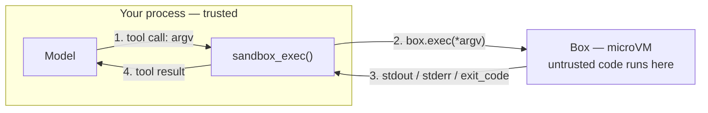

Your process owns the conversation and the tool calls; the box only executes. Every BoxLite line below is identical whichever provider you call — for the opposite arrangement, where the agent CLI lives inside the box, see [Run Claude Code](/agent-in-box/run-claude-code).

## When to use this

| Situation | Why this pattern fits |
|---|---|
| The model writes commands or code you must actually run | A wrong or hostile command hits a disposable microVM, not your host |
| The agent needs to iterate — run, read the error, try again | A Box is stateful across calls, so the working directory and installed packages persist within the session |
| You already own the agent loop (your own framework, or a provider SDK) | BoxLite plugs in as one tool implementation; nothing else in your loop changes |
| You need per-task isolation for untrusted or multi-tenant work | One Box per task, destroyed on exit |

---

## The contract

An agent loop that can touch a machine always has the same three moving parts. Only the middle one is BoxLite's job:



1. **Tool declaration** — a JSON Schema describing what the model may ask for. Provider-specific *wrapper*, identical *schema*.
2. **Tool implementation** — runs the command in a Box and returns a plain dict. **100% provider-independent.**
3. **Result feedback** — hand the dict back to the model. Provider-specific plumbing.

So the page is organised the same way: step 1 is written once, step 2 is written per provider, and switching providers changes about ten lines.

---

## Prerequisites

- A working BoxLite install (Python `boxlite` or Node `@boxlite-ai/boxlite`) and a machine with hardware virtualization — see [Installation](/getting-started/installation#platform-and-virtualization-requirements-common-to-all-sdks).
- **Any model endpoint that supports tool / function calling**, plus that provider's client library. The examples show two protocols; the requirement is the capability, not the vendor.

---

## Step 1 — The box side (identical for every provider)

This is the only BoxLite code in an agent loop. Copy it as-is; it does not change when you switch models.

<CodeGroup>

```python Python
# box_tool.py — the sandbox tool, provider-independent
import boxlite

# The schema body is plain JSON Schema, so every provider accepts it unchanged.
SANDBOX_EXEC_SCHEMA = {
    "type": "object",
    "properties": {
        "argv": {
            "type": "array",
            "items": {"type": "string"},
            "description": "Command and arguments, e.g. ['python', '-c', 'print(1)']",
        }
    },
    "required": ["argv"],
}

SANDBOX_EXEC_DESCRIPTION = (
    "Run a command inside an isolated sandbox and return its stdout, stderr and exit code."
)


async def sandbox_exec(box, argv) -> dict:
    """The single door between the model and the environment.

    Always returns a dict — never raises — so one bad tool call cannot end the loop.
    """
    if not isinstance(argv, list) or not argv or not all(isinstance(a, str) for a in argv):
        return {"stdout": "", "stderr": "argv must be a non-empty list of strings", "exit_code": 2}
    try:
        result = await box.exec(*argv)
    except RuntimeError as exc:
        # A command the image does not have (a common model hallucination) raises here.
        # Report it as a tool result so the model can correct itself.
        return {"stdout": "", "stderr": f"command could not be started: {exc}", "exit_code": -1}
    # A non-zero exit does NOT raise — pass the exit code back and let the model react.
    return {"stdout": result.stdout, "stderr": result.stderr, "exit_code": result.exit_code}
```

```typescript Node.js
// boxTool.ts — the sandbox tool, provider-independent
import { SimpleBox } from "@boxlite-ai/boxlite";

// The schema body is plain JSON Schema, so every provider accepts it unchanged.
export const SANDBOX_EXEC_SCHEMA = {
  type: "object",
  properties: {
    argv: {
      type: "array",
      items: { type: "string" },
      description: "Command and arguments, e.g. ['python', '-c', 'print(1)']",
    },
  },
  required: ["argv"],
};

export const SANDBOX_EXEC_DESCRIPTION =
  "Run a command inside an isolated sandbox and return its stdout, stderr and exit code.";

interface SandboxExecResult {
  stdout: string;
  stderr: string;
  exitCode: number;
}

// The single door between the model and the environment.
// Always returns an object — never throws — so one bad tool call cannot end the loop.
export async function sandboxExec(box: SimpleBox, argv: unknown): Promise<SandboxExecResult> {
  if (!Array.isArray(argv) || argv.length === 0 || !argv.every((a) => typeof a === "string")) {
    return { stdout: "", stderr: "argv must be a non-empty array of strings", exitCode: 2 };
  }
  try {
    const result = await box.exec(argv[0], ...argv.slice(1));
    // A non-zero exit does NOT throw — pass the exit code back and let the model react.
    return { stdout: result.stdout, stderr: result.stderr, exitCode: result.exitCode };
  } catch (err) {
    // A command the image does not have (a common model hallucination) throws here.
    // Report it as a tool result so the model can correct itself.
    return { stdout: "", stderr: `command could not be started: ${err instanceof Error ? err.message : err}`, exitCode: -1 };
  }
}
```

</CodeGroup>

Only this step is BoxLite-specific — Step 2's provider wrappers are the same OpenAI/Anthropic client libraries regardless of which language drives the box, so they are not duplicated per language.

Two behaviors above are worth internalising, because both are how an agent loop dies in production:

| Case | What BoxLite does | What the wrapper must do |
|---|---|---|
| Command exits non-zero (`sh -c 'exit 3'`) | Returns `ExecResult(exit_code=3)`, **no exception** | Pass `exit_code` back so the model sees the failure |
| Command does not exist in the image (`nope`) | Raises `RuntimeError` (`spawn_failed`) | **Catch it** and return it as a tool result, or the loop crashes |

Verified end to end against a real `alpine:latest` box, covering every path above: a normal command, a non-zero exit (`exitCode: 3`), a missing command (`exitCode: -1` with the real `spawn_failed` message), and an invalid `argv`.

---

## Step 2 — The model side (swappable)

Only this step is provider-specific. The schema from step 1 is reused verbatim; providers differ in how they wrap it and how tool results are fed back.

=== "OpenAI-compatible endpoints"

    Covers OpenAI itself and every gateway that speaks the same protocol — MiniMax, self-hosted vLLM, Ollama, and others. Switching among them means changing `base_url` and `model`, nothing else.

    ```python
    # provider_openai.py
    import json
    import os
    from openai import AsyncOpenAI

    from box_tool import SANDBOX_EXEC_SCHEMA, SANDBOX_EXEC_DESCRIPTION, sandbox_exec

    TOOLS = [{
        "type": "function",
        "name": "sandbox_exec",
        "description": SANDBOX_EXEC_DESCRIPTION,
        "parameters": SANDBOX_EXEC_SCHEMA,        # <-- the shared schema, unchanged
    }]

    def build_client():
        # base_url is what selects the endpoint. Omit it for OpenAI itself.
        return AsyncOpenAI(
            api_key=os.environ["<YOUR_API_KEY_ENV_VAR>"],   # e.g. OPENAI_API_KEY
            base_url=os.getenv("<YOUR_BASE_URL_ENV_VAR>"),  # e.g. https://api.minimax.io/v1
        )

    async def run_turn(client, box, goal, model, max_rounds=12):
        response = await client.responses.create(
            model=model,                                    # e.g. "<YOUR_MODEL>"
            instructions="Use sandbox_exec to interact with the environment. Summarize when done.",
            input=[{"role": "user", "content": goal}],
            tools=TOOLS,
            tool_choice="auto",
        )
        for _ in range(max_rounds):
            calls = [item for item in response.output if item.type == "function_call"]
            if not calls:
                return response
            outputs = []
            for call in calls:
                args = json.loads(call.arguments or "{}")
                result = await sandbox_exec(box, args.get("argv", []))
                outputs.append({
                    "type": "function_call_output",
                    "call_id": call.call_id,
                    "output": json.dumps(result),
                })
            response = await client.responses.create(
                model=model,
                previous_response_id=response.id,
                input=outputs,
                tools=TOOLS,
                tool_choice="auto",
            )
        return response
    ```

=== "Anthropic"

    Same schema, different wrapper key (`input_schema` instead of `parameters`) and an explicit message list instead of response chaining.

    ```python
    # provider_anthropic.py
    import os
    from anthropic import AsyncAnthropic

    from box_tool import SANDBOX_EXEC_SCHEMA, SANDBOX_EXEC_DESCRIPTION, sandbox_exec

    TOOLS = [{
        "name": "sandbox_exec",
        "description": SANDBOX_EXEC_DESCRIPTION,
        "input_schema": SANDBOX_EXEC_SCHEMA,      # <-- the same shared schema
    }]

    def build_client():
        return AsyncAnthropic(api_key=os.environ["<YOUR_API_KEY_ENV_VAR>"])  # e.g. ANTHROPIC_API_KEY

    async def run_turn(client, box, goal, model, max_rounds=12):
        messages = [{"role": "user", "content": goal}]
        for _ in range(max_rounds):
            response = await client.messages.create(
                model=model,                                # e.g. "<YOUR_MODEL>"
                max_tokens=4096,
                system="Use sandbox_exec to interact with the environment. Summarize when done.",
                messages=messages,
                tools=TOOLS,
            )
            calls = [b for b in response.content if b.type == "tool_use"]
            if not calls:
                return response
            messages.append({"role": "assistant", "content": response.content})
            results = []
            for call in calls:
                result = await sandbox_exec(box, call.input.get("argv", []))
                results.append({
                    "type": "tool_result",
                    "tool_use_id": call.id,
                    "content": str(result),
                })
            messages.append({"role": "user", "content": results})
        return response
    ```

**Why the first tab is the default in the full example below**: the OpenAI-compatible protocol reaches the widest set of endpoints, including self-hosted ones — not because that provider is recommended. The only requirement BoxLite places on your model is that it supports tool calling.

---

## Full example

Ties both steps together. To move to another provider, change the import on the marked line — nothing else.

```python
# agent.py — run with: python agent.py
import asyncio
import os

import boxlite

from box_tool import sandbox_exec  # noqa: F401  (used by the provider module)
from provider_openai import build_client, run_turn   # <-- swap this line to change provider


async def main() -> None:
    goal = "Check the Python version, then compute the first 10 primes and print them."
    try:
        client = build_client()
        # One Box per task: created on entry, destroyed on exit.
        async with boxlite.SimpleBox(image="python:slim") as box:
            response = await run_turn(client, box, goal, model=os.environ["<YOUR_MODEL_ENV_VAR>"])
            print(response)
    except RuntimeError as exc:
        # No hardware virtualization, or the image could not be pulled.
        print(f"sandbox unavailable: {exc}")


if __name__ == "__main__":
    asyncio.run(main())
```

> Verified: the box side (`sandbox_exec` against a real `python:slim` Box) was run end to end, including the non-zero-exit and missing-command paths. The provider modules were checked against each SDK's published call signature; the Anthropic tab was not exercised end to end here.

---

## Parameters and returns

Only the BoxLite surface is listed — your provider SDK documents its own.

### `SimpleBox(...)` — the options that matter in an agent loop

| Parameter | Type | Required | Default | Description |
|---|---|---|---|---|
| `image` | `str` | one of two | — | OCI image the agent works in; give it the interpreters the task needs |
| `rootfs_path` | `str` | one of two | — | Path to a local OCI image layout directory (the on-disk form of a container image); an alternative to `image` |
| `cpus` | `int` | no | `None` | vCPUs; set explicitly in production |
| `memory_mib` | `int` | no | `None` | Memory in MiB; set explicitly in production |
| `auto_remove` | `bool` | no | `True` | Destroy the Box when it stops — the usual choice for per-task isolation |
| `name` | `str` | no | auto | Name it if the same agent session must reattach later |

### `await box.exec(cmd, *args, ...) -> ExecResult`

| Parameter | Type | Default | Description |
|---|---|---|---|
| `cmd`, `*args` | `str` | — | Command and arguments passed separately, never as one string |
| `env` | `dict[str, str]` | `None` | Per-execution environment variables (a **dict** at this layer) |
| `timeout` | `float` | `None` | Seconds. On timeout the process is signalled and `exit_code` is negative; no exception is raised |
| `cwd` | `str` | image config | Working directory |
| `user` | `str` | image default | User to run as, like `docker exec --user` |

| `ExecResult` field | Type | Description |
|---|---|---|
| `exit_code` | `int` | Non-zero does **not** raise — feed it back to the model |
| `stdout` / `stderr` | `str` | Already aggregated and decoded |
| `error_message` | `str \| None` | Set only when the process died abnormally |

---

## Troubleshooting

### Box side

| Symptom | Cause | Fix |
|---|---|---|
| `RuntimeError: ... spawn_failed ... not found in $PATH` | The model asked for a binary the image does not have | Catch it in the tool wrapper (step 1) and return it as a tool result; give the model an image that has what it needs |
| `ValueError: Either 'image' or 'rootfs_path' must be provided` | `SimpleBox()` constructed with neither | Pass one of them |
| The box fails to start | No hardware virtualization, or the image could not be pulled | See [Installation](/getting-started/installation#platform-and-virtualization-requirements-common-to-all-sdks) |
| `exec("false")` returned instead of raising | By design | Check `exit_code` yourself — see [Error handling](/guides/error-handling#troubleshooting) |

### Loop side (any provider)

| Symptom | Cause | Fix |
|---|---|---|
| The model calls the tool but the loop never advances | Tool results were not appended to the conversation, or the call id was not echoed back | Send every result back with the id the provider gave you (`call_id` / `tool_use_id`) |
| `KeyError` / empty `argv` on the tool call | Models occasionally emit malformed arguments | Validate in the wrapper and return a `stderr` message instead of raising — the model will retry |
| The agent loops forever | No round cap | Keep the `max_rounds` bound and return the last response |
| Provider returns a `400` about a parameter | A model-specific option your request set | That is a provider-side contract; check that provider's API reference |

---

## Related pages

- [Run Claude Code](/agent-in-box/run-claude-code) — the inverse arrangement: an agent CLI running **inside** the Box, and `SkillBox`.
- [Run Python code in a box](/agent-tools/code-execution-python) — `CodeBox.run(code)` when the model returns Python source rather than a command line.
- [Error handling](/guides/error-handling) — which failures raise and which are returned.
- [Running sandboxes at scale](/guides/at-scale) — concurrency, resource ceilings, and cleanup for many parallel agents.

### Running several agents at once

BoxLite ships orchestration primitives (`BoxRuntime` / `ManagedBox`) behind an extra:

```bash
pip install "boxlite[orchestration]"
```

Their API is still evolving, so this page does not restate signatures that may change. The runnable references are `examples/python/07_advanced/multi_agent/` in the repository.
