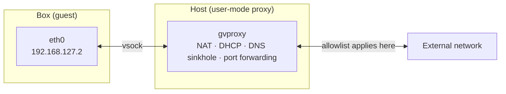

> For the SDK-facing parameters (`NetworkSpec`, `ports`) see [Network access](/manage-sandbox/network-access).

BoxLite uses **user-mode networking**: the box's `eth0` connects over vsock to a user-mode proxy on the host side, which handles NAT, DHCP, and DNS. No root required, no TUN/TAP device, and no impact on the host network.



**Backend implementations** (source `src/boxlite/src/net/`):

| Backend | Notes | When to use |
|---|---|---|
| gvproxy (default) | A user-mode network based on the gVisor network stack, providing NAT / DHCP / DNS / port forwarding / traffic metering | The default backend, for nearly all scenarios |
| libslirp (alternative) | QEMU's user-mode network stack | Environments where gvproxy is unavailable |

**Fixed virtual subnet layout** (source `src/boxlite/src/net/constants.rs`):

| Name | Value | Role |
|---|---|---|
| Subnet | `192.168.127.0/24` | The box's virtual network segment |
| Gateway IP | `192.168.127.1` | The gvproxy listen address, also the guest DNS |
| Guest IP | `192.168.127.2` | The address `eth0` inside the box receives (via DHCP) |
| Host loopback alias | `192.168.127.254` | Traffic to this IP is NAT'd to the host `127.0.0.1` |
| Host hostname | `host.boxlite.internal` | A built-in DNS name used inside the box to reach host loopback services |

**Network configuration is delivered to the guest via DHCP**: IP, default gateway, and DNS server (defaulting to the host resolver).

### Controlling the Network from the SDK

The network is controlled by `NetworkSpec`. `mode` takes two values, `"enabled"` and `"disabled"`; an allowlist is `mode="enabled"` plus a non-empty `allow_net`:

```python
import boxlite

# 1) Default: mode="enabled", allow_net=[] —— allow all outbound
net_full = boxlite.NetworkSpec(mode="enabled")

# 2) Allowlist: only listed domains are allowed; other DNS is sinkholed to 0.0.0.0
net_allow = boxlite.NetworkSpec(mode="enabled", allow_net=["example.com", "pypi.org"])

# 3) Fully offline: no network interface inside the box
net_off = boxlite.NetworkSpec(mode="disabled")
```

**Port forwarding** uses the `ports` parameter (host -> guest); the simplest form is a `(host_port, guest_port)` tuple:

```python
import asyncio
import boxlite

async def main():
    try:
        async with boxlite.SimpleBox(
            image="python:alpine",
            ports=[(8080, 8080)],  # host 8080 -> guest 8080
        ) as box:
            # The service must bind 0.0.0.0, otherwise host-forwarded traffic cannot reach it
            await box.exec(
                "sh", "-c",
                "nohup python -m http.server 8080 --bind 0.0.0.0 >/dev/null 2>&1 &",
            )
            await asyncio.sleep(1)
            print("box up:", box.id)
    except RuntimeError as e:
        print("failed:", e)

if __name__ == "__main__":
    asyncio.run(main())
```

---

## Troubleshooting

| Symptom / error | Cause | Resolution |
|---|---|---|
| Connecting to the forwarded port from the host times out / fails | The service inside the guest bound `127.0.0.1` | The service must bind `0.0.0.0`. The network stack forwards host traffic to the guest NIC `192.168.127.2`, not the guest loopback. |
| A non-allowlisted domain resolves to `0.0.0.0` | This is expected behavior: `allow_net` sinkholes non-allowlisted domains to `0.0.0.0` | To allow everything, use `NetworkSpec(mode="enabled")` (without `allow_net`). |
| In `disabled` mode, `nslookup`/networking all fail | There is no network interface inside the box | Use `mode="enabled"` when you need networking; use `disabled` for pure-compute tasks. |
| `RuntimeError` (during image pull) | Network hiccup / wrong image name / unreachable registry | Catch with `try/except RuntimeError` and retry; confirm the image reference is correct and outbound is reachable. A failed pull raises a standard `RuntimeError`, not `BoxliteError`. |
| The box fails to start but the host process survives | No hardware virtualization (Linux missing KVM / WSL2 KVM not enabled) | On Linux confirm `/dev/kvm` exists and the user is in the `kvm` group; macOS (Apple Silicon) uses Hypervisor.framework, no KVM required. |
| A mounted file's uid/gid inside the guest does not match expectations | virtiofs performs id mapping; the host and guest users are not necessarily the same | Inside the box use `stat -c '%u %g' <file>` and `id` to check; specify a particular user via `BoxOptions(user=...)` when needed. |

---

## Related pages

- [Network access](/manage-sandbox/network-access) — the parameters and how to use them
- [Storage](/architecture/storage) — image cache, rootfs, and volumes
- [Security and isolation](/architecture/security-and-isolation) — where the network boundary sits
