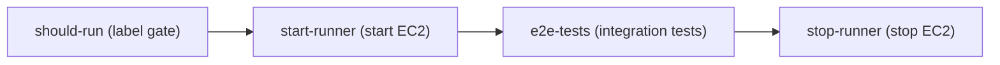

`e2e-local.yml` runs them on a persistent AWS EC2 self-hosted runner, because the tests boot real microVMs and need hardware virtualization. Below: how CI provisions the machine, how to read a failure, and the exact commands to reproduce the same run locally.

## Prerequisites

- A working BoxLite install (Python `boxlite` or Node `@boxlite-ai/boxlite`) and a machine with hardware virtualization — see [Installation](/getting-started/installation#platform-and-virtualization-requirements-common-to-all-sdks).
- Install build dependencies: CI uses `scripts/setup/setup-ubuntu.sh` (Ubuntu). Locally you can use the project's `make setup`.
- The repository root has a `Makefile` (aggregating `make/*.mk`); the test entry point is `make test:integration`.
- Operating the CI infrastructure requires the GitHub `gh` CLI and admin access to the repository (to dispatch the workflow and configure variables/secrets).

## Quick Example (shortest reproduction path)

### Reproduce locally (same commands as CI)

```bash
# 1) Verify virtualization is available (Linux). Skip on macOS Apple Silicon — it uses Hypervisor.framework.
test -c /dev/kvm && test -r /dev/kvm -a -w /dev/kvm \
  && echo "/dev/kvm OK" \
  || echo "WARN: /dev/kvm unavailable (ignore on macOS Apple Silicon; fix required on Linux, see Troubleshooting)"

# 2) Install build dependencies (first run or after dependency changes).
#    On Ubuntu runners CI runs scripts/setup/setup-ubuntu.sh; locally the aggregate target is enough.
make setup

# 3) Run the same integration test suite CI runs (the core command of e2e-local.yml).
make test:integration

# Optional: run only the core suite (Rust + CLI), faster than the full run.
make test:integration:core
```

> Tip: `make test:integration` actually boots microVMs. On a clean machine, the first run compiles the whole toolchain (roughly 5-10 minutes); subsequent runs reuse the cache and are significantly faster.

### `make test` vs `make test:integration:cli`

These two targets are not interchangeable:

- **`make test`** is `make test:changed`: it inspects the working tree, maps changed components to suites, and runs only those. With no detected changes it runs nothing (use `make test:all` for the full unit + integration matrix). Each changed component maps to its own suite — for example, a CLI change runs `make test:integration:cli`.
- **`make test:integration:cli`** runs only the CLI integration tests. It depends on `runtime:debug` (it builds the debug runtime first unless setup already ran), then runs the suite with `--no-fail-fast` so one failure does not hide the rest:

  ```bash
  # With cargo-nextest available (preferred):
  cargo nextest run -p boxlite-cli --tests --profile vm --no-fail-fast
  # Fallback (plain cargo):
  cargo test -p boxlite-cli --tests --no-fail-fast -- --test-threads=4
  ```

The CLI tests are real integration tests, not unit tests: each test pulls images, creates boxes, and runs the actual `boxlite` binary against a microVM. They therefore require the same virtualization environment as the rest of `make test:integration` (KVM on Linux, Hypervisor.framework on macOS). To keep first-run image pulls cheap and avoid registry rate limits, a shared, pre-warmed cache is set up once per test process and the standard test images (`alpine:latest`, `python:alpine`) are pre-pulled and reused. For how the CLI test harness itself is structured, see the [CLI Development Guide](/development/cli-development).

### Trigger a run in CI

```bash
# Manually dispatch the workflow (no PR label required).
gh workflow run e2e-local.yml

# Pass the debug input to open an SSH debug session (tmate) on failure.
gh workflow run e2e-local.yml -f debug=true
```

## How it runs (workflow structure)

The workflow has four jobs:



| Job | Role |
|---|---|
| **should-run** | Decides whether to run. Pushes and manual dispatches always run; a PR runs only when a maintainer applies the `e2e-local` label. |
| **start-runner** | Authenticates to AWS, starts the stopped instance (creating it if absent), and waits up to 3 minutes for the self-hosted runner to come online. |
| **e2e-tests** | Runs on the self-hosted runner (the `boxlite-e2e` label, 50-minute timeout): it first verifies `/dev/kvm`, installs build dependencies, then runs `make test:integration`. |
| **stop-runner** | Always runs at the end, stopping the instance to control cost. |

Note on the single-instance design: the workflow keeps **one persistent** EC2 instance for this test suite — started before a run and **stopped** afterward (never terminated) — so the build and image caches remain on the EBS volume. Because there is only one instance, only one e2e run can proceed at a time; a newer run cancels an older queued run.

### Triggers

| Trigger | Condition |
|---|---|
| push to `main` | Changes to runtime code: `src/boxlite/**`, `src/shared/**`, `src/cli/**`, `src/guest/**`, `src/shim/**`, `src/deps/**`, `sdks/**`, any `**/Cargo.toml`, `Cargo.lock`, `.gitmodules`, or the workflow file itself. |
| `pull_request_target` (`labeled` / `synchronize`) | Runs only when the PR carries the `e2e-local` label — the label is a cost gate that only maintainers can add. |
| `workflow_dispatch` | Manual trigger with an optional `debug` input: opens an SSH (tmate) session when a test fails. |

> Note on source prefixes: the trigger paths use the real repository layout `src/<crate>/` (`src/boxlite`, `src/shared`, `src/cli`, `src/guest`) and `sdks/**`, not the old `boxlite/src/` prefix.

## Instance & auth

| Attribute | Value |
|---|---|
| Instance type | Any instance family that supports nested virtualization (set via `EC2_INSTANCE_TYPE`) |
| AMI / region | Hardcoded in the workflow file (`AWS_REGION: us-east-1`, `EC2_AMI_ID`, `EC2_INSTANCE_TYPE`) — change them there, not via repository variables |
| Runner label | `boxlite-e2e` (registration label set `self-hosted,linux,x64,kvm,boxlite-e2e`) |
| Lifecycle | Persistent — stopped between runs, never terminated |
| Storage | gp3 root volume retained across runs; holds the `~/.cargo`, `target/`, and `~/.boxlite` caches |

Keeping the instance warm is why repeat runs are faster: a clean instance's first run requires a full compile (roughly 5-10 minutes of initialization), after which it reuses the cached toolchain and build artifacts. Running cost is the instance's on-demand rate while a run is in progress, plus the persistent root volume. Price it against your own account and region.

Authentication uses no long-lived secrets:

- **AWS** — GitHub OIDC is exchanged for short-lived STS credentials via the `boxlite-e2e-github-actions` IAM role. No AWS key is stored in the repository.
- **GitHub** — a GitHub App (`boxlite-e2e-runner`) issues runner registration tokens at run time. There is no personal access token.

## One-time setup (provisioning)

All AWS and GitHub infrastructure is provisioned by a single script:

```bash
# Run from the repository root. The script is idempotent: re-running reconciles existing resources.
./scripts/ci/setup-ci-runner.sh

# Provision the AWS side only:
./scripts/ci/setup-ci-runner.sh --skip-github

# Override auto-discovery:
./scripts/ci/setup-ci-runner.sh --region <YOUR_AWS_REGION> --vpc-id <YOUR_VPC_ID> --subnet-id <YOUR_SUBNET_ID>
# Note: replace <YOUR_VPC_ID> / <YOUR_SUBNET_ID> above with the real values from your account.
```

It auto-detects the AWS account, the repository, the default VPC, and a public subnet, and creates these AWS resources:

| Resource | Purpose |
|---|---|
| OIDC provider `token.actions.githubusercontent.com` | Lets GitHub Actions assume an AWS role |
| IAM role `boxlite-e2e-github-actions` | The role the workflow assumes (EC2 start/stop/run + pass-role) |
| IAM role + instance profile `boxlite-e2e-runner` | The runtime identity of the EC2 instance |
| Security group `boxlite-e2e-runner` | Egress on 443/80 only |

And it sets the following on the repository:

| Variables | Secret |
|---|---|
| `AWS_ACCOUNT_ID`, `AWS_SUBNET_IDS`, `AWS_SECURITY_GROUP_ID`, `GH_APP_ID`, `EC2_E2E_INSTANCE_ID` | `GH_APP_PRIVATE_KEY` |

The GitHub App is created through a script-driven browser manifest flow — follow the prompts to confirm and install the App. `EC2_E2E_INSTANCE_ID` is written automatically the first time the instance is created; later runs use it to locate the instance directly.

Once provisioning is complete, trigger a run:

```bash
gh workflow run e2e-local.yml
```

## Parameters & Returns (key parameters)

Workflow environment and inputs (from `e2e-local.yml`):

| Name | Type | Default | Description |
|---|---|---|---|
| `debug` | workflow_dispatch input (boolean) | `false` | Opens a tmate SSH session when a test fails; the instance stays running (auto-stops after 30 minutes idle). |
| `AWS_REGION` | env | — | Deployment region. |
| `EC2_INSTANCE_TYPE` | env | — | Instance type with nested virtualization support. |
| `EC2_AMI_ID` | env | — | Runner AMI. |
| `RUNNER_LABEL` | env | `boxlite-e2e` | Self-hosted runner label. |
| `e2e-local` | PR label | — | Cost gate; only maintainers can add it; triggers a run on a PR. |

Relevant make targets available locally:

| Command | Role |
|---|---|
| `make setup` | Install build dependencies (the local equivalent of CI's dependency-install step). |
| `make test:integration` | Run all integration suites (CI's core command; requires a VM). |
| `make test:integration:core` | Core suites only (Rust + CLI), faster than the full run. |
| `make test:integration:sdk` | SDK integration suites (Python + Node + C — deliberately excludes Go; requires a VM). |
| `make test:integration:python` / `:node` / `:c` / `:rust` / `:cli` / `:go` | Single-language / single-layer suites (some support `FILTER=<pattern>`). |

> The authoritative target list is `make help` (aggregated in `make/help.mk`); the table above is the common subset.

## Troubleshooting

| Symptom | Possible cause | Fix |
|---|---|---|
| `start-runner` times out waiting for the runner to come online | The instance started but the runner service did not register | Inspect the instance's runner logs; re-run the workflow to retry registration. |
| Launch fails with `InsufficientInstanceCapacity` | The chosen instance type has no capacity in that AZ | No action needed — the launch loop already retries each subnet/AZ; if all are exhausted, re-run later. |
| `e2e-tests` fails on insufficient disk | The `target/` build artifacts filled the volume | The job evicts the cache at 80% usage and refuses to run when free space drops below 20 GB; if it still fails, clean space on the instance manually. |
| A run cannot find the instance, or points at the wrong one | `EC2_E2E_INSTANCE_ID` is stale | It is recovered automatically via the `Name=boxlite-e2e` tag; clearing that variable forces rediscovery. |
| A PR did not trigger the workflow | The `e2e-local` label is missing | Have a maintainer add the label (it is a cost gate). |
| Local `make test:integration` reports `/dev/kvm not accessible` or VM startup fails | No virtualization / `/dev/kvm` not readable-writable | Linux: confirm your user is in the `kvm` group, or temporarily run `sudo chmod 666 /dev/kvm`; WSL2 needs KVM enabled. This is an environment constraint — without virtualization, microVMs cannot boot. |
| There is no `/dev/kvm` locally on macOS Apple Silicon | macOS does not use KVM | This is normal — macOS uses Apple Hypervisor.framework and needs no `/dev/kvm`; run `make test:integration`. |
| You need to log in to the runner to debug | — | Dispatch with `gh workflow run e2e-local.yml -f debug=true`; on failure it opens a tmate SSH session and keeps the instance (auto-stops after 30 minutes idle). |

## References (source)

The links below point to real files in the repository (these are for contributors to open directly):

- Workflow: `.github/workflows/e2e-local.yml`
- Provisioning script: `scripts/ci/setup-ci-runner.sh`
- Build-dependency install: `scripts/setup/setup-ubuntu.sh`
- Test entry point (make targets): `Makefile` + `make/*.mk` (run `make help` for all targets)
- CI overview: `.github/workflows/README.md`

## See also

- [CLI Development Guide](/development/cli-development) — building and testing the BoxLite CLI, including how the CLI integration tests differ from the full matrix.
