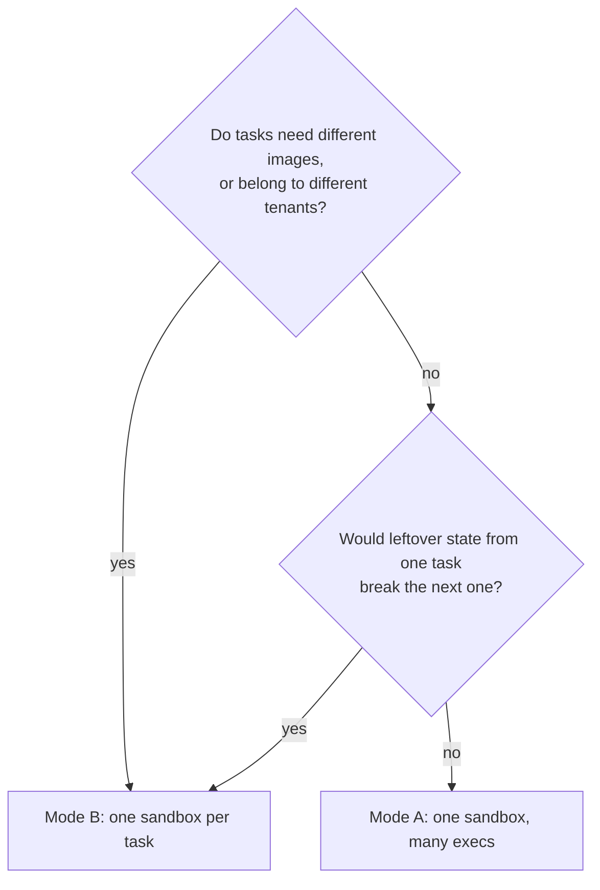

Three classes of incident account for almost all of it: paying VM startup cost you did not need to, letting one box exhaust the host, and leaking boxes that outlive the process that made them. None of the fixes require weakening isolation.

## The checklist

Work down this list before putting an agent that drives sandboxes into production. Each row links to the section that explains it, so this doubles as the page outline.

| ✓ | Item | Where |
|---|---|---|
| ☐ | `cpus` / `memory_mib` set explicitly per box — never rely on the runtime default | [Resource ceilings](#resource-ceilings) |
| ☐ | `SecurityOptions.standard()` or `.maximum()` passed for untrusted code | [Security: strong isolation](#security-strong-isolation) |
| ☐ | Every `exec` result's `exit_code` checked — a non-zero exit does not raise | [Troubleshooting](#troubleshooting) |
| ☐ | Timeouts use `SimpleBox.exec(timeout=...)` rather than `asyncio.wait_for` | [Timeouts and zombie-process protection](#timeouts-and-zombie-process-protection) |
| ☐ | Cleanup guaranteed by `async with`, or by `runtime.remove(id, force=True)` in a `finally` | [Cleanup](#cleanup-guarantee-sandboxes-are-reclaimed) |
| ☐ | Concurrency sized against host memory, not against task count | [Concurrency model](#concurrency-model) |
| ☐ | Secrets injected with `Secret(...)`, never interpolated into prompts or commands | [Inject secrets](#inject-secrets-secret-vault-entry-point) |
| ☐ | Image pulled and cached before peak load — the first pull is the slow one | [Boot latency](/architecture/boot-latency) |

## A production skeleton

The most concise and stable production skeleton: a `SimpleBox` with resources
and strong isolation configured, cleaned up automatically by `async with`.

```python
# pip install boxlite
import asyncio

import boxlite
from boxlite import BoxOptions, SecurityOptions, SimpleBox

# AdvancedBoxOptions is not exported at the top level; import it from boxlite.boxlite
from boxlite.boxlite import AdvancedBoxOptions

async def main() -> None:
    # SimpleBox creates/starts the sandbox only on entering async with, and stops/reclaims it on exit
    try:
        async with SimpleBox(
            image="python:slim",
            cpus=2,             # CPU limit
            memory_mib=1024,    # memory limit (exceeding it triggers OOM and kills the sandbox)
            auto_remove=True,   # auto-delete on exit (default True)
        ) as box:
            result = await box.exec("python", "-c", "print('hello from sandbox')")
            # A non-zero exit code does not raise; check exit_code yourself
            if result.exit_code != 0:
                print(f"command failed (exit={result.exit_code}): {result.stderr}")
            else:
                print(result.stdout.strip())
    except RuntimeError as exc:
        # Image pull failure or absence of virtualization raises a standard RuntimeError
        print(f"sandbox start failed: {exc}")

if __name__ == "__main__":
    asyncio.run(main())
```

> The example above uses the `SimpleBox` "lazy box creation" path. If you need
> finer-grained options across multiple sandboxes (strong isolation, volumes,
> secrets, etc.), use the runtime `Boxlite` + `BoxOptions` directly (see the
> concurrency and security sections below).

---

## Concurrency model

Two modes; choose based on your isolation needs.

Choosing between the two modes:



### Mode A: one sandbox, many execs (recommended default)

A single sandbox can carry many `exec()` calls; each `exec` spawns a new process
inside the same VM. The VM startup cost is paid once, and the VM boundary itself
already provides hardware isolation from the host. This fits the vast majority
of agent scenarios.

```python
# pip install boxlite
import asyncio

import boxlite
from boxlite import BoxOptions, SecurityOptions
from boxlite.boxlite import AdvancedBoxOptions

async def main() -> None:
    # Boxlite is a synchronous context manager (with), but its data methods (create/remove/...) are async and require await
    try:
        with boxlite.Boxlite.default() as runtime:
            box = await runtime.create(
                BoxOptions(
                    image="python:slim",
                    cpus=2,
                    memory_mib=1024,
                    advanced=AdvancedBoxOptions(
                        security=SecurityOptions.maximum()
                    ),
                )
            )
            try:
                # Launch multiple executions concurrently within the same sandbox
                executions = await asyncio.gather(
                    box.exec("python", ["-c", "print('task A')"]),
                    box.exec("python", ["-c", "print('task B')"]),
                    box.exec("python", ["-c", "print('task C')"]),
                )
                for execution in executions:
                    result = await execution.wait()  # native Execution.wait()
                    # The ExecResult returned by native Execution.wait() has only exit_code / error_message,
                    # not stdout/stderr; use the high-level SimpleBox.exec to capture output.
                    print(f"exit={result.exit_code}")
            finally:
                # Removal happens on the runtime: runtime.remove(id, force=); there is no box.remove().
                # force=True stops the running box before deleting it.
                await runtime.remove(box.id, force=True)
    except RuntimeError as exc:
        print(f"runtime/sandbox error: {exc}")

if __name__ == "__main__":
    asyncio.run(main())
```

> Note: when called through the wrapper, `runtime.create(...)` returns a native
> `Box` (an async context manager). Here we obtain the box via
> `await runtime.create(...)` and then stop/remove it manually. The native
> signature of `box.exec(...)` takes `args: list` as its second argument, and
> its timeout parameter is `timeout_secs` (unlike the high-level
> `SimpleBox.exec`'s `timeout`).

### Mode B: one sandbox per agent / task

When you need strong cross-tenant isolation, different images, or independent
resource ceilings, give each task its own sandbox.

```python
# pip install boxlite
import asyncio

from boxlite import SimpleBox

async def run_isolated(code: str, image: str = "python:slim") -> str:
    """Each task gets a dedicated sandbox; async with guarantees cleanup on completion."""
    try:
        async with SimpleBox(image=image, memory_mib=512) as box:
            result = await box.exec("python", "-c", code)
            if result.exit_code != 0:
                return f"[failed exit={result.exit_code}] {result.stderr.strip()}"
            return result.stdout.strip()
    except RuntimeError as exc:
        return f"[sandbox error] {exc}"

async def main() -> None:
    outputs = await asyncio.gather(
        run_isolated("print('agent 1')"),
        run_isolated("print('agent 2')", image="node:alpine"),  # different image
        run_isolated("print('agent 3')"),
    )
    for line in outputs:
        print(line)

if __name__ == "__main__":
    asyncio.run(main())
```

| Mode | When to use | Cost |
|---|---|---|
| A: one sandbox, many execs | Most agent tool loops | VM startup paid once; processes share the same VM |
| B: one sandbox per task | Multi-tenant isolation / different images / independent resource ceilings | Each sandbox pays its own VM startup cost |

---

## Timeouts and zombie-process protection

`asyncio.wait_for()` only cancels the Python coroutine; it does **not** kill the
process inside the sandbox --- the process keeps running inside the VM. The two
correct approaches follow.

### Approach 1 (recommended): use `SimpleBox.exec(timeout=...)`

The high-level `SimpleBox.exec` has a built-in `timeout` (float, seconds). On
timeout, BoxLite terminates the process on the sandbox side via signal, leaving
no stray process.

> Key point: a `SimpleBox.exec` timeout **does not raise `TimeoutError`** --- it
> returns an `ExecResult` whose `exit_code` is negative (the process is
> terminated by `SIGTERM`, so `exit_code == -15`). Always check
> `result.exit_code`; do not use `except TimeoutError`.

```python
# pip install boxlite
import asyncio

from boxlite import SimpleBox

async def main() -> None:
    try:
        async with SimpleBox(image="python:slim", memory_mib=512) as box:
            # timeout is a float in seconds; on timeout the sandbox side terminates the process
            result = await box.exec(
                "python", "-c", "import time; time.sleep(9999)",
                timeout=5.0,
            )
            # Timeout does not raise: returns a negative exit_code (process terminated by SIGTERM -> exit_code == -15)
            if result.exit_code != 0:
                print(f"command timed out or failed (exit={result.exit_code}); the sandbox side stopped the process")
            else:
                print(result.stdout.strip())
    except RuntimeError as exc:
        print(f"sandbox error: {exc}")

if __name__ == "__main__":
    asyncio.run(main())
```

### Approach 2: manual `wait_for` + `kill()` (native Execution)

When you use the native `box.exec(...)` directly to obtain an `Execution`, you
must call `kill()` explicitly in the timeout branch.

```python
# pip install boxlite
import asyncio

import boxlite
from boxlite import BoxOptions

async def exec_with_timeout(box, cmd, args=None, timeout=30.0):
    """Native execution + timeout cleanup: on timeout you must explicitly kill, otherwise the process becomes a zombie inside the VM."""
    execution = await box.exec(cmd, args or [])
    try:
        return await asyncio.wait_for(execution.wait(), timeout=timeout)
    except asyncio.TimeoutError:
        try:
            await execution.kill()  # key step: kill the process inside the sandbox
        except Exception:
            pass  # best effort
        raise

async def main() -> None:
    try:
        with boxlite.Boxlite.default() as runtime:
            box = await runtime.create(BoxOptions(image="python:slim"))
            try:
                try:
                    await exec_with_timeout(
                        box, "python",
                        ["-c", "import time; time.sleep(9999)"],
                        timeout=5.0,
                    )
                except asyncio.TimeoutError:
                    print("timed out; killed the process inside the sandbox")
            finally:
                # Remove directly (force=True stops the running box before deleting it)
                await runtime.remove(box.id, force=True)
    except RuntimeError as exc:
        print(f"runtime error: {exc}")

if __name__ == "__main__":
    asyncio.run(main())
```

---

## Resource ceilings

Set hard ceilings on a sandbox via the `BoxOptions` / `SimpleBox` constructor
parameters to prevent a runaway agent from exhausting host resources.

| Parameter | Type | Required | Default | Description |
|---|---|---|---|---|
| `cpus` | `int` | Optional | Engine default (see note) | vCPU ceiling |
| `memory_mib` | `int` | Optional | Engine default (see note) | Memory ceiling (MiB); exceeding it triggers OOM and kills the sandbox |
| `disk_size_gb` | `int` | Optional | None (unset uses the image default) | Persistent disk size (GB) |
| `working_dir` | `str` | Optional | None | Default working directory for commands |
| `auto_remove` | `bool` | Optional | `True` (SimpleBox) | Whether to auto-delete the sandbox on exit |

> Resource defaults: when `cpus`/`memory_mib` are not passed, the underlying
> engine allocates a default. To inspect the actual resources inside a box, use
> `nproc` / `/proc/meminfo`. For predictability and cost control, set them
> **explicitly** in production. See
> [Compute Resources](/manage-sandbox/compute-resources).

Choose a configuration by workload (the following are suggested starting points;
adjust as needed):

| Workload | Image | CPUs | Memory | Disk | Notes |
|---|---|---|---|---|---|
| Code execution | `python:slim` | 1 | 512 MiB | None | Ephemeral, fast start |
| Data analysis | `python:slim` | 2 | 2048 MiB | None | pandas/numpy need more memory |
| Browser automation | use `BrowserBox` | 2 | 2048 MiB | None | Chromium is resource-heavy |
| Multi-tool agent | `python:slim` | 2 | 1024 MiB | None | Trade-off between cost and capability |
| Persistent environment | `python:slim` | 1 | 512 MiB | 10 GB | State survives restarts |

```python
# pip install boxlite
import asyncio

import boxlite
from boxlite import BoxOptions

async def main() -> None:
    try:
        with boxlite.Boxlite.default() as runtime:
            box = await runtime.create(
                BoxOptions(
                    image="python:slim",
                    cpus=1,            # CPU limit
                    memory_mib=512,    # hard memory limit; exceeding it triggers OOM
                    working_dir="/workspace",
                )
            )
            try:
                # The ExecResult from native wait() has only exit_code/error_message, no stdout
                result = await (await box.exec("nproc", [])).wait()
                print(f"exit={result.exit_code}")
            finally:
                # Remove directly (force=True stops the running box before deleting it)
                await runtime.remove(box.id, force=True)
    except RuntimeError as exc:
        print(f"runtime error: {exc}")

if __name__ == "__main__":
    asyncio.run(main())
```

### Observe runtime resource usage

Use the runtime-level `metrics()` for global metrics, noting the actual field
names. Although `Boxlite` is a synchronous context manager, `metrics()` is an
**async method (requires `await`)**, so call it inside an async function.

```python
# pip install boxlite
import asyncio

import boxlite

async def main() -> None:
    try:
        # Boxlite is a synchronous context manager (with, not async with)
        with boxlite.Boxlite.default() as runtime:
            m = await runtime.metrics()  # metrics() is async; must await
            print("running boxes:", m.num_running_boxes)        # not active_boxes
            print("created total:", m.boxes_created_total)
            print("failed total:", m.boxes_failed_total)
            print("commands total:", m.total_commands_executed)
            print("exec errors total:", m.total_exec_errors)
    except RuntimeError as exc:
        print(f"runtime error: {exc}")

if __name__ == "__main__":
    asyncio.run(main())
```

| Object | Field | Description |
|---|---|---|
| `RuntimeMetrics` | `num_running_boxes` | Currently running sandboxes (not `active_boxes`) |
| `RuntimeMetrics` | `boxes_created_total` / `boxes_failed_total` | Cumulative created/failed |
| `RuntimeMetrics` | `total_commands_executed` / `total_exec_errors` | Cumulative commands/exec errors |
| `BoxMetrics` (`await box.metrics()`) | `memory_bytes` | Memory usage in bytes (not `memory_usage_bytes`) |
| `BoxMetrics` | `cpu_percent` | CPU percentage (not `cpu_time_ms`) |

---

## Security: strong isolation

Security options are passed **via `advanced`**; there is no top-level
`security=` keyword. `AdvancedBoxOptions` is not exported at the top level and
must be imported from `boxlite.boxlite`.

```python
# pip install boxlite
import asyncio

import boxlite
from boxlite import BoxOptions, SecurityOptions
from boxlite.boxlite import AdvancedBoxOptions  # only in the native module

async def main() -> None:
    try:
        with boxlite.Boxlite.default() as runtime:
            box = await runtime.create(
                BoxOptions(
                    image="python:slim",
                    cpus=1,
                    memory_mib=512,
                    # Correct form: security is passed via advanced
                    advanced=AdvancedBoxOptions(
                        security=SecurityOptions.maximum()
                    ),
                )
            )
            try:
                result = await (await box.exec("id", [])).wait()
                print(f"exit={result.exit_code}")
            finally:
                # Remove directly (force=True stops the running box before deleting it)
                await runtime.remove(box.id, force=True)
    except RuntimeError as exc:
        print(f"sandbox error: {exc}")

if __name__ == "__main__":
    asyncio.run(main())
```

### Security presets

`SecurityOptions` has three preset static methods (**there is no `.minimum()`**;
the weak preset is called `development()`):

| Preset | Jailer | Seccomp | Use case |
|---|---|---|---|
| `SecurityOptions.development()` | off | off | Debugging sandbox issues |
| `SecurityOptions.standard()` | on | on (Linux) | General workloads |
| `SecurityOptions.maximum()` | on | on (Linux) | Untrusted AI code (recommended for agents) |

You can also construct a custom one (keyword arguments):

```python
# pip install boxlite
from boxlite import SecurityOptions

# Custom: based on maximum, tighten networking as needed
custom = SecurityOptions(
    jailer_enabled=True,
    seccomp_enabled=True,
    network_enabled=False,  # disable sandbox outbound networking (an effective control on macOS)
)
print(type(custom).__name__)
```

> In the Python bindings, `network_enabled` is currently a macOS-side control.
> On Linux, network isolation is typically achieved via `NetworkSpec`
> (`BoxOptions(network=...)`) together with publishing no ports. To disconnect
> the network entirely, use it together with `BoxOptions(network=NetworkSpec(...))`;
> see [Network Access](/manage-sandbox/network-access).

### Read-only volumes: the third element is a bool, not a string

When mounting data into a sandbox, use a read-only volume to prevent it from
being overwritten. **The third element of a volume is the `bool read_only`
(`True` = read-only / `False` = read-write), not the string `"ro"`/`"rw"`**; a
2-tuple also works (default read-write).

```python
# pip install boxlite
from boxlite import BoxOptions

options = BoxOptions(
    image="python:slim",
    volumes=[
        ("/host/datasets", "/mnt/data", True),     # True = read-only, agent can only read
        ("/host/results", "/mnt/results", False),  # False = read-write, used for output
        ("/host/cache", "/mnt/cache"),             # 2-tuple = default read-write
    ],
)
# BoxOptions validates volume types at construction (the third element must be a bool),
# but provides no .volumes read-back attribute after construction; this only confirms construction succeeded.
print("volumes configured")
```

> Passing a string raises directly:
> `TypeError: 'str' object cannot be cast as 'bool'` (see Troubleshooting). The
> CLI's `-v host:box:ro` syntax uses `ro`/`rw` strings and belongs to the CLI
> parsing layer --- **it is different from the SDK's bool**, so do not confuse
> them.

### Inject secrets (Secret / Vault entry point)

Do not write tokens in cleartext into commands or the environment; use
`BoxOptions(secrets=[Secret(...)])`.

```python
# pip install boxlite
from boxlite import BoxOptions, Secret

options = BoxOptions(
    image="python:slim",
    secrets=[
        Secret(
            name="API_TOKEN",
            value="<YOUR_API_KEY>",        # TODO: replace with your real key (do not commit to the repository)
            hosts=["api.example.com"],     # inject only to these hosts
            placeholder="{{API_TOKEN}}",
        ),
    ],
)
print(len(options.secrets), "secret(s)")
```

For complete secret usage, see
[Secrets and Security](/manage-sandbox/secrets-and-security).

---

## Cleanup: guarantee sandboxes are reclaimed

| Method | When to use | Key point |
|---|---|---|
| `async with SimpleBox(...)` | High-level wrapper, single sandbox | Auto stop + delete on exit (`auto_remove=True`) |
| `runtime.remove(id, force=False)` | When using the `Boxlite` runtime directly | **Removal is on the runtime**; there is no `box.remove()` |
| `runtime.shutdown(timeout=...)` | Batch reclaim before process exit | `None` = 10s, `-1` = wait indefinitely |
| `boxlite ps -a` then `boxlite rm -a -f` | After an abnormal process exit | Every method above runs **inside** your process. A `SIGKILL`, an OOM kill, or a panic skips all of them, and the boxes plus their disks survive |

Boxes outlive the process that created them, so a hard kill leaves them running and holding disk and host ports. Recover from the command line:

```bash
# List every box, including ones no longer owned by a live process
boxlite ps -a

# Remove one by name or ID (-f also removes it if still running)
boxlite rm -f <BOX_NAME_OR_ID>

# Or reclaim everything
boxlite rm -a -f
```

```python
# pip install boxlite
import asyncio

import boxlite
from boxlite import BoxOptions

async def main() -> None:
    try:
        with boxlite.Boxlite.default() as runtime:
            box = await runtime.create(
                BoxOptions(image="python:slim"),
                name="agent-worker-1",
            )
            try:
                await (await box.exec("true", [])).wait()
            finally:
                # Use the runtime method to remove (not box.remove()); accepts id or name;
                # force=True stops the running box before deleting it.
                await runtime.remove("agent-worker-1", force=True)

            # List remaining sandboxes with list_info() (not list()); it is async and requires await
            for info in await runtime.list_info():
                # box.info() is synchronous; but runtime.list_info() is async
                # BoxInfo.state is a BoxStateInfo; the status string is in .state.status
                print(info.id, info.state.status)
    except RuntimeError as exc:
        print(f"runtime error: {exc}")

if __name__ == "__main__":
    asyncio.run(main())
```

> List with `runtime.list_info()` (not `list()`); it is an **async method
> (requires `await`)**. Note the distinction: `box.info()` is a **synchronous**
> getter (do not `await` it), whereas `runtime.list_info()` /
> `runtime.metrics()` / `runtime.remove()` / `runtime.create()` /
> `runtime.shutdown()` are all **async (require `await`)**. `BoxInfo.state` is a
> `BoxStateInfo`, and the sandbox status string is in `info.state.status`.

---

## File transfer (production patterns)

| Method | Direction | Suitable for | Size limit |
|---|---|---|---|
| `box.copy_in()` | host -> sandbox | Files/directories | Large files |
| `box.copy_out()` | sandbox -> host | Extracting results | Large files |
| `exec` + base64 | Both | Tiny inline data | ~1 MB (shell limit) |
| Volume mount | Both | Shared datasets/config | Unlimited |

```python
# pip install boxlite
import asyncio

from boxlite import SimpleBox

async def main() -> None:
    try:
        async with SimpleBox(image="python:slim", memory_mib=512) as box:
            # Copy the script into the sandbox (SimpleBox.copy_in defaults to overwrite=True)
            await box.copy_in("<YOUR_PATH>/script.py", "/workspace/script.py")  # TODO: replace path

            result = await box.exec("python", "/workspace/script.py")
            if result.exit_code != 0:
                print(f"script failed: {result.stderr}")

            # Copy the result back to the host
            await box.copy_out("/workspace/output.json", "<YOUR_PATH>/output.json")  # TODO: replace path
    except FileNotFoundError as exc:
        print(f"host file not found: {exc}")
    except RuntimeError as exc:
        print(f"sandbox error: {exc}")

if __name__ == "__main__":
    asyncio.run(main())
```

Recommendation: use `copy_in`/`copy_out` for dynamic, per-request files;
read-only volumes for shared datasets; and inline base64 only for tiny payloads.

---

## Troubleshooting

| Symptom | Cause | Fix |
|---|---|---|
| `AttributeError: 'SecurityOptions' has no attribute 'minimum'` | That preset does not exist | Presets are `development()` / `standard()` / `maximum()` |
| `AttributeError: 'Box' object has no attribute 'remove'` | Removal is a runtime operation | `await runtime.remove(box.id, force=True)` |
| `RuntimeError: box not found` right after `stop()` | `stop()` with `auto_remove` already removed the box | Clean up with `runtime.remove(id, force=True)` alone — do not chain `stop()` + `remove()` |
| Native `Execution.wait()` result has no `stdout` / `stderr` | The native `ExecResult` carries only `exit_code` and `error_message` | Stream output with `execution.stdout()`, or use the wrapper `SimpleBox.exec` which aggregates both |
| `AttributeError` when reading `BoxOptions.volumes` | `volumes` is write-only on the options object (`secrets` is readable) | Track the volume list in your own code if you need to read it back |
| `RuntimeError: ... spawn_failed ... not found in $PATH` | The command does not exist in the image | Install it first, or catch `RuntimeError` around `exec` |
| `exec` returned a non-zero exit and raised nothing | By design | Check `result.exit_code` after every `exec` — see [Error handling](/guides/error-handling#troubleshooting) |
| `RuntimeError` while pulling an image | Network instability, wrong reference, or missing registry auth | Retry with backoff; verify the image reference and any registry credentials |
| A process survives `await execution.wait()` after a timeout | The timeout signalled the process but a child kept running | Prefer `SimpleBox.exec(timeout=...)`, which reaps the process tree |
| `RuntimeError: no running event loop` on a runtime call | `Boxlite` is entered with a synchronous `with`, but its methods are async | `await` every runtime method; only `box.info()` is synchronous |
| The box fails to start at all | No hardware virtualization available | See [Installation](/getting-started/installation#platform-and-virtualization-requirements-common-to-all-sdks) |

### Passing a string for a volume -> `TypeError: 'str' object cannot be cast as 'bool'`

```python
# Wrong: the third element is a string
BoxOptions(image="python:slim", volumes=[("/host", "/mnt", "ro")])
# TypeError: 'str' object cannot be cast as 'bool'
```

The third element is the `bool read_only`: use `True` for read-only, `False` or
omit it (2-tuple) for read-write. The CLI's `:ro`/`:rw` belongs to the CLI layer
syntax and is unrelated to the SDK API.

### `AttributeError: module 'boxlite' has no attribute 'AdvancedBoxOptions'`

`AdvancedBoxOptions` lives in the `boxlite.boxlite` submodule, not the top level — import it from there:

```python
from boxlite.boxlite import AdvancedBoxOptions  # correct
```

And security options are passed via `advanced`; there is no top-level
`security=`:
`BoxOptions(advanced=AdvancedBoxOptions(security=SecurityOptions.maximum()))`.

## See Also

- [Lifecycle Management](/manage-sandbox/lifecycle) --- create / get / remove / shutdown
- [Compute Resources](/manage-sandbox/compute-resources) --- cpus / memory_mib / disk_size_gb
- [Volumes](/manage-sandbox/volumes) --- the read_only bool
- [Network Access](/manage-sandbox/network-access) --- NetworkSpec and outbound control
- [Secrets and Security](/manage-sandbox/secrets-and-security) --- Secret / SecurityOptions detail
- [Run code in any language](/agent-tools/code-execution-any-language) --- SimpleBox.exec
- [Deploy in Docker or Kubernetes](/guides/deployment) --- Docker / Kubernetes

## A tour: one agent session, one sandbox

Moved here from the section index, which is now a summary and an index.


Below is a **minimal, runnable tool-execution loop for an agent**: it runs the
command "the model wants to execute" inside a sandbox, checks the exit code, and
formats the result into a string you can feed back to the model. A hardcoded
tool call stands in for real LLM output so you can copy and run it directly;
when you wire in a real model, replace `tool_call` with the model's returned
tool call.


<CodeGroup>

```python Python
import asyncio
from boxlite import SimpleBox

async def run_tool_in_sandbox(box: SimpleBox, command: str, *args: str) -> str:
    """Execute a tool call inside the sandbox; return text to feed back to the LLM."""
    # A non-zero exit code does not raise; check exit_code yourself
    result = await box.exec(command, *args, timeout=30.0)  # timeout is in seconds (float)
    if result.exit_code != 0:
        return f"[tool error exit={result.exit_code}] {result.stderr.strip()}"
    return result.stdout.strip()

async def main() -> None:
    try:
        # auto_remove=True is the default: leaving async with destroys this session sandbox
        async with SimpleBox(image="alpine:latest", cpus=1, memory_mib=512) as box:
            # In a real scenario, this step comes from the LLM's returned tool call
            tool_call = ("sh", "-c", "echo 'analyzing...' && uname -sm")

            observation = await run_tool_in_sandbox(box, *tool_call)
            print("observation fed back to LLM:\n", observation)
            # Append the observation to the conversation history and continue the next agent loop
    except RuntimeError as e:
        # Image pull failure or absence of hardware virtualization raises a standard RuntimeError
        print("sandbox start or pull failed:", e)

asyncio.run(main())
```

```typescript Node.js
import { SimpleBox } from "@boxlite-ai/boxlite";

async function runToolInSandbox(
  box: SimpleBox,
  command: string,
  args: string[],
): Promise<string> {
  const result = await box.exec(command, args, undefined, { timeoutSecs: 30 });
  if (result.exitCode !== 0) {
    return `[tool error exit=${result.exitCode}] ${result.stderr.trim()}`;
  }
  return result.stdout.trim();
}

async function main(): Promise<void> {
  try {
    // await using: at scope exit, destroy the session sandbox per autoRemove (default true)
    await using box = new SimpleBox({
      image: "alpine:latest",
      cpus: 1,
      memoryMib: 512,
    });

    // In a real scenario, this step comes from the LLM's returned tool call
    const observation = await runToolInSandbox(box, "sh", [
      "-c",
      "echo 'analyzing...' && uname -sm",
    ]);
    console.log("observation fed back to LLM:\n", observation);
  } catch (e) {
    console.error("sandbox start or pull failed:", e);
  }
}

main();
```

</CodeGroup>

Node differs in three places: the package name is `@boxlite-ai/boxlite`, `SimpleBox` cleans up via `await using`, and the `exec` timeout option is `timeoutSecs`.

> For a complete tool loop where a real LLM drives the sandbox, see
> [Drive a sandbox from your agent loop](/agent-tools/drive-from-agent-loop).

---
