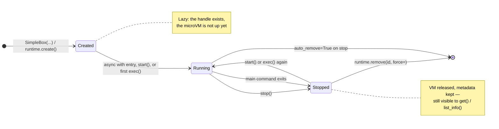

Which state a box is in decides whether your next `exec` starts it, restarts it and reuses its disk, or fails. Two switches then decide how long it lives: `auto_remove` and `detach`.

## The states



| State | How you get there | What exists | What you can do |
|---|---|---|---|
| **Created** | `SimpleBox(...)` or `await runtime.create(...)` | A handle and a database record. **No VM yet** | Nothing on the box itself — the next `exec` or `async with` entry starts it |
| **Running** | `async with` entry, `start()`, or the first `exec()` | VM up, rootfs mounted | `exec`, `copy_in` / `copy_out`, `metrics()`. `start()` is idempotent |
| **Stopped** | `stop()`, or the main command exiting | VM released, **rootfs and metadata kept** | Still found by `get()` / `list_info()`; `exec` or `start()` brings it back with files intact |
| **Removed** | `runtime.remove(id, force=)`, or `auto_remove=True` on stop | Nothing | Gone from the runtime and from disk |

Two transitions are worth committing to memory:

- **Creation is lazy.** Constructing a box returns a handle; the microVM comes up on first use. A box that never runs costs nothing but a database row.
- **Stop is not remove.** `stop()` frees the VM but keeps the disk, so restarting reuses everything the box had installed. That is what makes a box a reusable workspace rather than a one-shot container.

Read the current state with `info = await box.info()`. **It must be awaited on every type** — the native `Box` returns an awaitable Future and `SimpleBox` returns a coroutine; neither yields `BoxInfo` directly. Field names are exact and easy to get wrong: see [`BoxInfo` / `BoxStateInfo`](#boxinfo-boxstateinfo-state-access).

## The main command

Every box has one **main command**: the `entrypoint + cmd` it was created with, running as the container init — PID 1 inside the box. It is the process the box exists to run, and the box's lifetime is tied to it.

A main command of `sh -c 'echo "pid=$$"; exit 7'` prints `pid=1`, confirming it is init rather than a process alongside one.

Three things stop a box, and only one of them is a call you make:

| Cause | Trigger |
|---|---|
| **The main command exits** | It finishes, or it crashes |
| `stop()` | You call it |
| `auto_stop` | Idle timeout, on BoxLite Cloud — see [Box lifecycle](/cloud/box-lifecycle) |

Two rules follow:

- **Once the main command has exited, `exec` is refused**: `RuntimeError: invalid state: Cannot exec box <id>: it is stopped, and its main command has already exited`. Bring the box back with `start()`.
- **You cannot stop the main command from inside the box.** `kill -TERM 1` is dropped, because PID 1 in a PID namespace ignores signals it has no handler for. That is kernel behaviour, not a BoxLite bug. It ends when it exits on its own, or when the host calls `stop()`.

**There is no restart policy.** A main command that crashes stops the box; nothing restarts it. Supervise from the host — check the state and call `start()` — or use the pattern below that keeps your workload off the main command.

Status flips about a second after the main command exits, so poll it rather than reading it immediately.

For how `entrypoint` and `cmd` combine into the main command, see [Environment and startup](/manage-sandbox/environment#the-relationship-between-entrypoint-and-cmd).

## Exit codes

`BoxStateInfo` carries `pid`, `running` and `status` — **no exit code**. To read the main command's exit code, attach to it. `attach()` with no argument follows the main command's session, and its `wait()` returns the code:

```python
import asyncio

from boxlite import BoxOptions, Boxlite


async def main() -> None:
    runtime = Boxlite.default()
    # attach() lives on the box returned by runtime.create(), not on SimpleBox
    box = await runtime.create(BoxOptions(
        image="alpine:latest",
        cmd=["sh", "-c", "echo 'work done'; exit 7"],
    ))
    await box.start()

    execution = await box.attach()          # no argument: the main command's session
    async for line in execution.stdout():
        print(line.rstrip())                # -> work done

    result = await execution.wait()
    print("exit code:", result.exit_code)   # -> 7


if __name__ == "__main__":
    asyncio.run(main())
```

Two constraints shape that example:

- `attach()` exists on the box returned by `runtime.create()`. **`SimpleBox` has no `attach()`**, and neither does the sync API, so reading a main command's exit code means using `Boxlite` and `BoxOptions` directly.
- Exit codes from `exec` are separate and easier: `ExecResult.exit_code`, no attach needed. See [Run any language](/agent-tools/code-execution-any-language#parameters-and-returns).

## Three ways to start work in a box

Which one you pick decides whether the box outlives the work.

| Pattern | How | Box lifetime | Cost |
|---|---|---|---|
| **Work beside the main command** | Keep the image's main command; run jobs with `exec`, services with `nohup … &` | Independent of the work | A crashed service leaves the box `running` and the port dead |
| **Work as the main command** | Set `entrypoint` / `cmd`, then `attach()` | Bound to the work | Requires `runtime.create()`; `SimpleBox` has no `attach()` |
| **Detached main command** | Work as the main command, plus `detach=True` and `auto_delete=0` | Outlives the process that created it | You remove it yourself |

Most agent work wants the first: the agent is a job, and you still want to read its workspace after it finishes. A long-running service usually wants the second, so that a dead service means a dead box rather than a silent one.

### Detached main command

`detach=True` keeps the box alive after the creating process exits. It rejects the default removal behaviour, since a box that removes itself on stop cannot be managed later:

```text
invalid argument: remove-on-stop is incompatible with detach=true.
Detached boxes should use auto_delete=0 (or deprecated auto_remove=false) for manual lifecycle control.
```

Set `auto_delete=0` alongside it, and stop the box yourself when you are done. A local runtime has no idle timeout, so a detached box runs until something stops it.

## Walking the states in code

The example below runs standalone: create → exec → stop → remove. `auto_remove=False` is used to demonstrate the separate stop and remove steps.

<CodeGroup>

```python Python
import asyncio
import boxlite

async def main():
    # synchronous context manager: initializes the runtime on entry, calls close() on exit
    with boxlite.Boxlite.default() as runtime:
        box_id = None
        try:
            # 1. create (note: when called via the wrapper layer, create returns an awaitable; must await)
            box = await runtime.create(
                boxlite.BoxOptions(
                    image="alpine:latest",   # pulled over the network on first run
                    cpus=2,
                    memory_mib=512,
                    auto_remove=False,       # keep the box after stopping, to demonstrate remove
                )
            )
            box_id = box.id
            print(f"created: {box_id}")

            # 2. the first exec automatically starts the box (start is idempotent; explicit call is optional)
            execution = await box.exec("echo", ["hello from box"])
            # the underlying execution.stdout() yields already-decoded str chunks; use them directly, do not call .decode()
            async for chunk in execution.stdout():
                print("  ", chunk.strip())
            result = await execution.wait()
            print(f"  exit_code = {result.exit_code}")  # a non-zero exit code does not raise; check it yourself

            # 3. state query: info() must be awaited
            info = await box.info()
            print(f"  state = {info.state.status}, running = {info.state.running}")

            # 4. stop (shut down the VM, preserve rootfs)
            await box.stop()
            print("stopped")

        finally:
            # 5. remove: called on the runtime, not box.remove()
            if box_id:
                try:
                    await runtime.remove(box_id, force=True)
                    print("removed")
                except Exception as exc:
                    print(f"remove failed: {exc}")

if __name__ == "__main__":
    asyncio.run(main())
```

```typescript Node.js
import { JsBoxlite } from "@boxlite-ai/boxlite";

async function main(): Promise<void> {
  // withDefaultConfig() is the process-wide singleton runtime; close() is synchronous
  const runtime = JsBoxlite.withDefaultConfig();
  let boxId: string | null = null;
  try {
    // 1. create (always returns a Promise; await it)
    const box = await runtime.create({
      image: "alpine:latest", // pulled over the network on first run
      cpus: 2,
      memoryMib: 512,
      autoRemove: false, // keep the box after stopping, to demonstrate remove
    });
    boxId = box.id;
    console.log(`created: ${boxId}`);

    // 2. the first exec automatically starts the box (start is idempotent; explicit call is optional)
    const execution = await box.exec("echo", ["hello from box"]);
    const stdout = await execution.stdout();
    while (true) {
      const line = await stdout.next();
      if (line === null) break; // EOF
      console.log("  ", line.trimEnd());
    }
    const result = await execution.wait();
    console.log(`  exitCode = ${result.exitCode}`); // a non-zero exit code does not throw; check it yourself

    // 3. state query — in Node, info() returns a Promise
    const info = await box.info();
    console.log(`  state = ${info.state.status}`);

    // 4. stop (shut down the VM, preserve rootfs)
    await box.stop();
    console.log("stopped");
  } finally {
    // 5. remove: called on the runtime, not box.remove()
    if (boxId) {
      try {
        await runtime.remove(boxId, true);
        console.log("removed");
      } catch (err) {
        console.error(`remove failed: ${err instanceof Error ? err.message : err}`);
      }
    }
    runtime.close();
  }
}

main();
```

</CodeGroup>

> Key point: `Boxlite` is a **synchronous** context manager (`with`), whereas a `Box`'s methods (`exec`/`stop`/`metrics`) are **async** (require `await`). `box.info()` must be awaited as well.

Verified: real run prints `created: <box-id>`, `hello from box`, `exitCode = 0`, `state = running`, `stopped`, `removed`.

---

## detach and auto_remove: two independent switches

`BoxOptions` has two boolean switches that control the lifecycle and do not affect each other:

| Parameter | Type | Default | Meaning |
|---|---|---|---|
| `auto_remove` | bool | `True` | `True`: remove the Box automatically on `stop()` (like Docker `--rm`); `False`: keep it after stopping so it can be restarted, requiring a manual `remove()` |
| `detach` | bool | `False` | `False`: the Box is bound to the parent process and stops when the parent exits (prevents orphans); `True`: the Box runs independently and survives the parent exiting (like Docker `-d`) |

Common combinations:

| Combination | Scenario |
|---|---|
| `auto_remove=True, detach=False` (default) | One-off tasks, ephemeral code execution; cleaned up as soon as it finishes |
| `auto_remove=False, detach=False` | Iterative development / debugging: preserve the disk after stopping and continue on the next restart |
| `auto_remove=False, detach=True` | Long-running services / daemons: survive the parent process and reattach later |

> `auto_remove=True` together with `detach=True` is **invalid** (a detached Box needs manual lifecycle control); setting both fails validation with an error.

### Restarting a stopped Box (rootfs reuse)

For an `auto_remove=False` Box, the disk persists after `stop()`. Re-acquire a handle and `exec` again, and the VM restarts reusing the original rootfs:

<CodeGroup>

```python Python
import asyncio
import boxlite

async def main():
    with boxlite.Boxlite.default() as runtime:
        box_id = None
        try:
            box = await runtime.create(
                boxlite.BoxOptions(image="alpine:latest", auto_remove=False)
            )
            box_id = box.id

            # write a file to prove the disk persists
            await (await box.exec("sh", ["-c", "echo data > /root/note.txt"])).wait()

            await box.stop()
            print("stopped; rootfs preserved")

            # re-acquire the handle (the box is stopped; get still returns a handle)
            box = await runtime.get(box_id)
            if box is None:
                raise RuntimeError(f"box {box_id} not found")

            # exec triggers a restart, reusing the original rootfs
            execution = await box.exec("cat", ["/root/note.txt"])
            async for chunk in execution.stdout():  # stdout() yields str
                print("  file after restart:", chunk.strip())
            await execution.wait()

            await box.stop()
        finally:
            if box_id:
                try:
                    await runtime.remove(box_id, force=True)
                except Exception as exc:
                    print(f"remove failed: {exc}")

if __name__ == "__main__":
    asyncio.run(main())
```

```typescript Node.js
import { JsBoxlite } from "@boxlite-ai/boxlite";

async function main(): Promise<void> {
  const runtime = JsBoxlite.withDefaultConfig();
  let boxId: string | null = null;
  try {
    let box = await runtime.create({ image: "alpine:latest", autoRemove: false });
    boxId = box.id;

    // write a file to prove the disk persists
    await (await box.exec("sh", ["-c", "echo data > /root/note.txt"])).wait();

    await box.stop();
    console.log("stopped; rootfs preserved");

    // re-acquire the handle (the box is stopped; get still returns a handle)
    const reattached = await runtime.get(boxId);
    if (reattached === null) throw new Error(`box ${boxId} not found`);
    box = reattached;

    // exec triggers a restart, reusing the original rootfs
    const execution = await box.exec("cat", ["/root/note.txt"]);
    const stdout = await execution.stdout();
    while (true) {
      const line = await stdout.next();
      if (line === null) break;
      console.log("  file after restart:", line.trimEnd());
    }
    await execution.wait();

    await box.stop();
  } finally {
    if (boxId) {
      try {
        await runtime.remove(boxId, true);
      } catch (err) {
        console.error(`remove failed: ${err instanceof Error ? err.message : err}`);
      }
    }
    runtime.close();
  }
}

main();
```

</CodeGroup>

> Note: data written to tmpfs paths such as `/tmp` does **not** persist across restarts; only data written to ordinary paths on the rootfs (such as `/root`) persists.

Verified: real run prints `stopped; rootfs preserved` then `file after restart: data`.

---

## reattach: getting a second handle in the same process

`runtime.get(id_or_name)` returns a new handle to an existing Box; the Box may be running or stopped. When `get` finds nothing it returns `None` (it does not raise).

<CodeGroup>

```python Python
import asyncio
import boxlite

async def main():
    with boxlite.Boxlite.default() as runtime:
        box_id = None
        try:
            box = await runtime.create(
                boxlite.BoxOptions(image="alpine:latest", auto_remove=False)
            )
            box_id = box.id
            await (await box.exec("echo", ["running"])).wait()

            # acquire a second handle pointing to the same box
            handle2 = await runtime.get(box_id)
            if handle2 is None:
                raise RuntimeError("reattach failed: box not found")

            execution = await handle2.exec("echo", ["via second handle"])
            async for chunk in execution.stdout():  # stdout() yields str
                print("  ", chunk.strip())
            await execution.wait()

            await box.stop()
        finally:
            if box_id:
                try:
                    await runtime.remove(box_id, force=True)
                except Exception as exc:
                    print(f"remove failed: {exc}")

if __name__ == "__main__":
    asyncio.run(main())
```

```typescript Node.js
import { JsBoxlite } from "@boxlite-ai/boxlite";

async function main(): Promise<void> {
  const runtime = JsBoxlite.withDefaultConfig();
  let boxId: string | null = null;
  try {
    const box = await runtime.create({ image: "alpine:latest", autoRemove: false });
    boxId = box.id;
    await (await box.exec("echo", ["running"])).wait();

    // acquire a second handle pointing to the same box
    const handle2 = await runtime.get(boxId);
    if (handle2 === null) throw new Error("reattach failed: box not found");

    const execution = await handle2.exec("echo", ["via second handle"]);
    const stdout = await execution.stdout();
    while (true) {
      const line = await stdout.next();
      if (line === null) break;
      console.log("  ", line.trimEnd());
    }
    await execution.wait();

    await box.stop();
  } finally {
    if (boxId) {
      try {
        await runtime.remove(boxId, true);
      } catch (err) {
        console.error(`remove failed: ${err instanceof Error ? err.message : err}`);
      }
    }
    runtime.close();
  }
}

main();
```

</CodeGroup>

Verified: real run prints `via second handle`.

---

## Cross-process sharing

One process creates and initializes a Box with `detach=True` and exits; the Box keeps running, and another process takes it over with `runtime.get(box_id)`.

> Important: do **not** use `Boxlite.default()` for cross-process scenarios. `default()` is a process-wide static singleton that keeps holding the runtime lock and does not release it even after a child process exits. Use `boxlite.Boxlite(boxlite.Options())` instead to construct a releasable runtime instance.

The following is a self-contained script: the parent forks a child that creates a detached Box, and after the child exits the parent takes it over.

<CodeGroup>

```python Python
import asyncio
import subprocess
import sys

import boxlite

async def child_create_box():
    """Child process: create a detached box, print its id, then exit (the box stays alive)."""
    # construct a releasable runtime with Options(); the lock is released on exit
    runtime = boxlite.Boxlite(boxlite.Options())
    box = await runtime.create(
        boxlite.BoxOptions(image="alpine:latest", detach=True, auto_remove=False)
    )
    # exec to ensure the box finishes initialization
    await (await box.exec("echo", ["initialized"])).wait()
    print(f"BOX_ID:{box.id}")
    sys.stdout.flush()
    # do not call stop(); the box keeps running. The runtime is dropped and the lock is released

async def parent_reattach():
    """Parent process: fork a child to create the box, then take it over from this process."""
    proc = subprocess.run(
        [sys.executable, __file__, "--child"],
        capture_output=True, text=True, timeout=120,
    )
    if proc.returncode != 0:
        raise RuntimeError(f"child failed: {proc.stderr}")

    box_id = None
    for line in proc.stdout.splitlines():
        if line.startswith("BOX_ID:"):
            box_id = line.split(":", 1)[1].strip()
            break
    if not box_id:
        raise RuntimeError(f"no box id from child; stdout={proc.stdout!r}")
    print(f"child created box: {box_id}")

    # the parent process also uses Options() rather than default()
    runtime = boxlite.Boxlite(boxlite.Options())
    try:
        info = await runtime.get_info(box_id)
        if info is None:
            raise RuntimeError("box not found in DB")
        print(f"box state in DB: {info.state.status}")

        box = await runtime.get(box_id)  # take over
        if box is None:
            raise RuntimeError("reattach failed")
        execution = await box.exec("echo", ["hello from parent process"])
        async for chunk in execution.stdout():  # stdout() yields str
            print("  ", chunk.strip())
        await execution.wait()
        print("cross-process reattach OK")
    finally:
        try:
            await runtime.remove(box_id, force=True)
        except Exception as exc:
            print(f"cleanup failed: {exc}")

if __name__ == "__main__":
    if len(sys.argv) > 1 and sys.argv[1] == "--child":
        asyncio.run(child_create_box())
    else:
        asyncio.run(parent_reattach())
```

```typescript Node.js
// Self-contained script: the parent spawns a child that creates a detached box,
// and after the child exits the parent takes it over.
import { spawnSync } from "node:child_process";
import { fileURLToPath } from "node:url";
import { JsBoxlite } from "@boxlite-ai/boxlite";

// @boxlite-ai/boxlite is ESM-only, so this file has no CommonJS __filename;
// derive the equivalent from import.meta.url.
const __filename = fileURLToPath(import.meta.url);

async function childCreateBox(): Promise<void> {
  // Do not use withDefaultConfig() here: it is a process-wide singleton that keeps
  // holding the runtime lock even after this child process exits. Use `new JsBoxlite({})`
  // instead to construct a releasable runtime instance.
  const runtime = new JsBoxlite({});
  const box = await runtime.create({ image: "alpine:latest", detach: true, autoRemove: false });
  // exec to ensure the box finishes initialization
  await (await box.exec("echo", ["initialized"])).wait();
  console.log(`BOX_ID:${box.id}`);
  // do not call stop(); the box keeps running. The runtime is dropped and the lock is released
}

async function parentReattach(): Promise<void> {
  const proc = spawnSync(process.execPath, [__filename, "--child"], {
    encoding: "utf-8",
    timeout: 120_000,
  });
  if (proc.status !== 0) throw new Error(`child failed: ${proc.stderr}`);

  let boxId: string | null = null;
  for (const line of proc.stdout.split("\n")) {
    if (line.startsWith("BOX_ID:")) {
      boxId = line.slice("BOX_ID:".length).trim();
      break;
    }
  }
  if (!boxId) throw new Error(`no box id from child; stdout=${proc.stdout}`);
  console.log(`child created box: ${boxId}`);

  // the parent process also uses `new JsBoxlite({})` rather than withDefaultConfig()
  const runtime = new JsBoxlite({});
  try {
    const info = await runtime.getInfo(boxId);
    if (info === null) throw new Error("box not found in DB");
    console.log(`box state in DB: ${info.state.status}`);

    const box = await runtime.get(boxId); // take over
    if (box === null) throw new Error("reattach failed");
    const execution = await box.exec("echo", ["hello from parent process"]);
    const stdout = await execution.stdout();
    while (true) {
      const line = await stdout.next();
      if (line === null) break;
      console.log("  ", line.trimEnd());
    }
    await execution.wait();
    console.log("cross-process reattach OK");
  } finally {
    try {
      await runtime.remove(boxId, true);
    } catch (err) {
      console.error(`cleanup failed: ${err instanceof Error ? err.message : err}`);
    }
    runtime.close();
  }
}

if (process.argv[2] === "--child") {
  childCreateBox();
} else {
  parentReattach();
}
```

</CodeGroup>

Box state persists in the runtime database, so it can be queried (`get_info`), taken over (`get`), and restarted (by `exec`-ing a stopped Box again) across process boundaries. Same shape in both languages: `withDefaultConfig()` / `Boxlite.default()` is the process-wide singleton and must **not** be used here — use `new JsBoxlite({})` / `boxlite.Boxlite(boxlite.Options())` for a releasable instance in both processes.

Verified: real run (parent spawning a child Node process) prints `child created box: <id>`, `box state in DB: running`, `hello from parent process`, `cross-process reattach OK`.

---

## Bulk shutdown: runtime.shutdown()

`runtime.shutdown(timeout=None)` gracefully shuts down every Box under that runtime. `timeout` is in seconds: `None` = default 10 seconds, `-1` = wait indefinitely. After shutdown, any creation-type operation raises `RuntimeError`.

<CodeGroup>

```python Python
import asyncio
import boxlite

async def main():
    runtime = boxlite.Boxlite.default()

    boxes = []
    for i in range(3):
        box = await runtime.create(boxlite.BoxOptions(image="alpine:latest"))
        boxes.append(box)
        print(f"created box {i + 1}: {box.id}")
        await (await box.exec("echo", [f"hi from box {i + 1}"])).wait()

    metrics = await runtime.metrics()
    print(f"running boxes before shutdown: {metrics.num_running_boxes}")

    await runtime.shutdown(timeout=5)  # 5-second timeout
    print("shutdown complete")

    # creation fails after shutdown
    try:
        await runtime.create(boxlite.BoxOptions(image="alpine:latest"))
        print("ERROR: expected failure")
    except RuntimeError as exc:
        print(f"expected error after shutdown: {exc}")

if __name__ == "__main__":
    asyncio.run(main())
```

```typescript Node.js
import { JsBoxlite } from "@boxlite-ai/boxlite";

async function main(): Promise<void> {
  const runtime = JsBoxlite.withDefaultConfig();

  const boxes = [];
  for (let i = 0; i < 3; i++) {
    const box = await runtime.create({ image: "alpine:latest" });
    boxes.push(box);
    console.log(`created box ${i + 1}: ${box.id}`);
    await (await box.exec("echo", [`hi from box ${i + 1}`])).wait();
  }

  const metrics = await runtime.metrics();
  console.log(`running boxes before shutdown: ${metrics.numRunningBoxes}`);

  await runtime.shutdown(5); // 5-second timeout
  console.log("shutdown complete");

  // creation fails after shutdown
  try {
    await runtime.create({ image: "alpine:latest" });
    console.log("ERROR: expected failure");
  } catch (err) {
    console.log(`expected error after shutdown: ${err instanceof Error ? err.message : err}`);
  }
}

main();
```

</CodeGroup>

Verified: real run prints `running boxes before shutdown: 3`, `shutdown complete`, then `expected error after shutdown: stopped: Cannot create box: runtime has been shut down`.

---

## Parameters and Returns

### `BoxOptions` (lifecycle-related fields)

| Field | Type | Required | Default | Description |
|---|---|---|---|---|
| `image` | str | Optional\* | — | Image reference, e.g. `alpine:latest`. At least one of `image` and `rootfs_path` |
| `rootfs_path` | str | Optional\* | — | Path to a local OCI image layout directory (the on-disk form of a container image); an alternative to `image` |
| `cpus` | int | Optional | 1 (see [Compute resources](/manage-sandbox/compute-resources)) | Number of vCPUs |
| `memory_mib` | int | Optional | 1024 | Memory in MiB |
| `auto_remove` | bool | Optional | `True` | Whether to remove automatically on `stop()` (mutually exclusive with `detach=True`\*\*) |
| `detach` | bool | Optional | `False` | Whether to survive the parent process (mutually exclusive with `auto_remove=True`\*\*) |

> Note: `name` is **not** a `BoxOptions` field; it is a separate parameter of `create(options, name=...)` / `get_or_create(options, name=...)`. Once named, you can operate by name with `get(name)` / `remove(name)`.

\* Provide one of `image` or `rootfs_path`; constructing with neither raises an error.
\*\* `auto_remove=True` and `detach=True` are mutually exclusive (a detached Box needs manual lifecycle management); setting both fails at validation.

### Runtime methods (called on a `Boxlite` instance)

| Method | Returns | Description |
|---|---|---|
| `create(options, name=None)` | `Box` | Create and register a Box |
| `get_or_create(options, name=None)` | `(Box, bool)` | Returns the Box and a `created` flag (reuses by name) |
| `get(id_or_name)` | `Box \| None` | Get a handle to an existing Box; returns `None` if not found |
| `get_info(id_or_name)` | `BoxInfo \| None` | Read Box info (without bringing up the VM); returns `None` if not found |
| `list_info(_state=None)` | `list[BoxInfo]` | List all Boxes (newest first); **not `list()`** |
| `remove(id_or_name, force=False)` | — | Remove a Box; `force=False` requires the Box to be stopped |
| `metrics()` | `RuntimeMetrics` | Runtime aggregate metrics |
| `shutdown(timeout=None)` | — | Shut down all Boxes (seconds; `None`=10s, `-1`=indefinite) |
| `close()` | — | Close the runtime handle (synchronous) |

### `Box` methods (async, all require `await`)

| Method | Returns | Description |
|---|---|---|
| `start()` | — | Bring up the VM, idempotent |
| `stop()` | — | Shut down the VM, preserve the rootfs (unless `auto_remove=True`) |
| `exec(command, args=None, ...)` | `Execution` | Run a command; triggers a restart on a stopped Box |
| `info()` | `BoxInfo` | **Await it**; does not trigger the VM |
| `metrics()` | `BoxMetrics` | Per-Box metrics |
| `id` / `name` | str | Properties |

### `BoxInfo` / `BoxStateInfo` (state access)

`await box.info()` returns a `BoxInfo`; its `state` field is a `BoxStateInfo`, and the state string is at `state.status`:

```python
info = await box.info()     # awaited on every box type
print(info.state.status)    # state string
print(info.state.running)   # bool
print(info.id, info.image, info.cpus, info.memory_mib)
```

| Path | Type | Description |
|---|---|---|
| `info.state` | `BoxStateInfo` | The outer field is `state` (not `status`) |
| `info.state.status` | str | The inner field is named `status` (not `state`) |
| `info.state.running` | bool | Whether it is running |
| `info.state.pid` | int \| None | Process id (if any) |

---

## Troubleshooting

### `info()` returns a coroutine, or refuses to be awaited

`info()` never returns `BoxInfo` directly — it must be awaited on every type. The native `Box` hands back an awaitable Future and `SimpleBox` a coroutine, so forgetting `await` fails slightly differently but always fails.

```python
info = await box.info()           # every box type

# box.info().state on the native Box  ->  AttributeError: '_asyncio.Future' object has no attribute 'state'
# box.info().state on a SimpleBox     ->  AttributeError: 'coroutine' object has no attribute 'state'

print(info.state.status)          # not info.status, and not info.state.state
```

### Calling `remove()` on a Box / using `list()`

Removal and listing both happen on the **runtime**, with the method names `remove`/`list_info`:

```python
# Wrong: await box.remove()           -> AttributeError
# Wrong: await runtime.list()         -> AttributeError
await runtime.remove(box.id, force=True)   # correct
infos = await runtime.list_info()          # correct
```

### Removing a running Box errors

`remove(id, force=False)` requires the Box to be stopped, otherwise it errors. Either `stop()` first, or use `force=True` (stop then remove):

```python
# calling remove(force=False) on a running box raises (the box is still running)
await box.stop()
await runtime.remove(box.id, force=False)   # or: runtime.remove(box.id, force=True)
```

### Using `Boxlite.default()` across processes leaves the lock unreleased

`default()` is a process-wide static singleton that holds the runtime lock until the process ends. Cross-process scenarios (a child creates, the parent takes over) must use `boxlite.Boxlite(boxlite.Options())` to construct a releasable instance, otherwise the taking-over process blocks or fails because it cannot acquire the lock.

> Current limitation: if the process holding the `default()` lock exits **abnormally** (crash, kill, or exiting without `close()`/`with`), a lock file may remain under `$BOXLITE_HOME/locks/`, causing the next `Boxlite.default()` to report `Another BoxliteRuntime is already using directory`. After confirming no boxlite process is alive (`lsof $BOXLITE_HOME/locks/*` shows no holder), you can clean it up manually with `rm -f $BOXLITE_HOME/locks/*` (`$BOXLITE_HOME` defaults to `~/.boxlite`). A runtime that exits normally via `with`/`close()` cleans up after itself.

### `execution.stdout()` yields `str`, not `bytes`

The underlying `Execution.stdout()` / `Execution.stderr()` async iterators yield **already-decoded `str`** chunks, not `bytes`. Use them directly; calling `chunk.decode(...)` as if they were `bytes` raises `AttributeError: 'str' object has no attribute 'decode'`.

```python
execution = await box.exec("echo", ["hi"])
async for chunk in execution.stdout():
    print(chunk.strip())          # correct: chunk is already a str
    # print(chunk.decode())       # wrong: str has no decode -> AttributeError
```

### `exec` exits non-zero without raising

`exec` reports a non-zero exit through `exit_code` / `exitCode`, not by raising. See [Error Handling](/guides/error-handling#troubleshooting).

### The box stopped without anyone calling `stop()`

Its main command exited. `exec` then fails with `invalid state: Cannot exec box <id>: it is stopped, and its main command has already exited`. Either keep the main command long-running, or treat the box as single-shot and read its exit code with `attach()`. See [The main command](#the-main-command).

### `kill -TERM 1` leaves the main command running

Expected: PID 1 in a PID namespace ignores signals with no handler. Stop the box from the host with `stop()` instead.

### `exec` rejects its arguments with a type error

`Box.exec` takes a list, `SimpleBox.exec` takes varargs. Passing a list to the second raises `TypeError: argument 'args': Can't extract str to Vec`, which does not name the expected shape.

```python
await box.exec("ls", ["-la"])   # Box, from runtime.create()
await box.exec("ls", "-la")     # SimpleBox
```

### No virtualization causes startup failure (environment constraint)

BoxLite requires hardware virtualization:

- Linux: requires KVM (`/dev/kvm` available; under WSL2 the user must be in the `kvm` group);
- macOS: uses Apple Hypervisor.framework, **no `/dev/kvm` required** (macOS arm64 supported); macOS Intel is not supported.

Without virtualization, Box startup fails (the process stays alive and can be caught with `try/except` to inform the user).

```python
try:
    box = await runtime.create(boxlite.BoxOptions(image="alpine:latest"))
    await box.exec("echo", ["ok"])
except RuntimeError as exc:
    print(f"startup failed; check that virtualization is available (Linux requires KVM): {exc}")
```

---

## Advanced: lifecycle when using SimpleBox

When you use the higher-level `SimpleBox` (an async context manager), it lazily creates and starts the Box on `async with` entry and cleans up on exit according to `auto_remove`. The lifecycle switches are passed the same way via constructor arguments:

```python
import asyncio
from boxlite import SimpleBox

async def main():
    # auto_remove defaults to True; when reuse_existing=True, reuse an existing box by name
    try:
        async with SimpleBox(image="alpine:latest", auto_remove=True) as box:
            result = await box.exec("echo", "hello")  # ExecResult
            print(result.stdout, "exit:", result.exit_code)
            info = await box.info()                    # SimpleBox: info() is a coroutine
            print("state:", info.state.status)
    except RuntimeError as exc:
        print(f"run failed (check virtualization): {exc}")

if __name__ == "__main__":
    asyncio.run(main())
```

> `SimpleBox.exec`'s timeout parameter is `timeout` (float) and its `env` is a `dict`; whereas the underlying `Box.exec`'s timeout parameter is `timeout_secs` and its `env` is a `list[tuple]`. For detach / cross-process / explicit restart, continue to use `Boxlite` + `Box` directly, because those operations require access to the Box id and the runtime.

## A tour of the whole lifecycle

Moved here from the section index, which is now a summary and an index.


Both examples below are directly runnable.

### A. Wrapper layer: lazy create and automatic cleanup (recommended starting point)

`SimpleBox` lazily creates and starts the Box on `async with` entry and, on exit, destroys it automatically according to `auto_remove` (default `True`), without touching the runtime handle directly.

```python
import asyncio
from boxlite import SimpleBox

async def main():
    try:
        # auto_remove=True is the default: cleanup happens automatically on async with exit
        async with SimpleBox(image="alpine:latest") as box:
            print("box id:", box.id)

            # info() must be awaited on every box type
            info = await box.info()
            print("state:", info.state.status)  # BoxStateInfo.status is a string

            # a non-zero exit code does not raise; check exit_code yourself
            result = await box.exec("echo", "hello from boxlite")
            print("exit_code:", result.exit_code)
            print("stdout:", result.stdout.strip())
    except RuntimeError as e:
        # image pull failure / no virtualization raises a standard RuntimeError
        print("startup or pull failed:", e)

asyncio.run(main())
```

### B. Explicit runtime management: create a named Box, reuse it across calls, then remove it explicitly

When you need a long-lived Box or want to reuse one across processes, operate the `Boxlite` runtime directly. Note two things: `Boxlite` enters with a **synchronous** `with`, but its **business methods are `async` and must be awaited**; a single `Box` is still an **async** context manager.


<CodeGroup>

```python Python
import asyncio
from boxlite import Boxlite, BoxOptions

async def main():
    with Boxlite.default() as runtime:
        try:
            # get_or_create is idempotent: reuse an existing Box with the same name, otherwise create one (async, must await)
            box, created = await runtime.get_or_create(
                BoxOptions(image="alpine:latest", auto_remove=False),
                name="my-worker",
            )
            print("created new box?", created)

            # a single Box is an async context manager
            async with box:
                result = await box.exec("uname", "-a")
                print(result.stdout.strip())

            # listing: the runtime method is list_info() (not list()), and it is async, must await
            for bi in await runtime.list_info():
                print(bi.id, bi.name, bi.state.status)

        finally:
            # removal is the runtime's responsibility: await runtime.remove(...), not box.remove()
            try:
                await runtime.remove("my-worker", force=True)
            except Exception as e:
                print("error during removal (ignorable, may already be cleaned up):", e)

asyncio.run(main())
```

```typescript Node.js
import { SimpleBox } from "@boxlite-ai/boxlite";

async function main(): Promise<void> {
  try {
    // await using: cleanup happens automatically at scope exit per autoRemove (default true)
    await using box = new SimpleBox({ image: "alpine:latest" });

    const result = await box.exec("echo", "hello from boxlite");
    console.log("exitCode:", result.exitCode);
    console.log("stdout:", result.stdout.trim());

    // in Node, info() returns a Promise on every type
    const info = await box.info();
    console.log("state:", info.state.status);
  } catch (e) {
    console.error("failed:", e);
  }
}

main();
```

</CodeGroup>

> Node differences: the package is `@boxlite-ai/boxlite`; the runtime class is `JsBoxlite` (there is no bare `Boxlite`); listing uses `listInfo()`; removal uses `runtime.remove(idOrName, force?)`; `SimpleBox` uses `await using` for automatic cleanup; `info()` and `getInfo()` both return a `Promise`.

---
