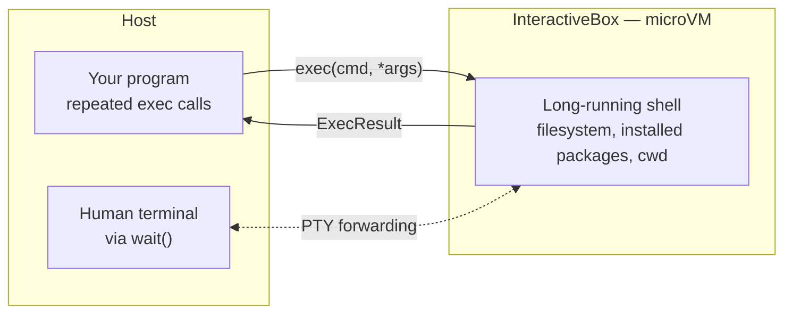

**Outcome:** a persistent shell session in a sandbox, driven programmatically or handed to a human terminal.

**Level:** beginner · **Time:** ~10 minutes · **Pattern:** multi-tenant platform.

## When to use this

Most sandbox work is one-shot: run something, take the output, throw the box away. A different class of problem needs the session to **stay alive**:

- **Remote dev boxes.** One clean isolated environment per user or per branch, where they install dependencies, edit files, and run tests.
- **A workbench for an agent.** A coding agent that runs `apt-get install`, then `git clone`, then `pytest` — where each step depends on state the previous one left behind.
- **Multi-tenant terminals.** A platform giving every tenant a shell isolated at the VM level, with no shared kernel or filesystem.

`CodeBox.run` cannot do this: every call is a fresh execution. `InteractiveBox` keeps a long-running shell inside the box, so repeated `exec` calls land in the same session and state persists between them. When a human needs it, the same box forwards a real PTY to their terminal.

## Architecture



The shell outlives individual commands, so everything written to disk, installed, or exported stays available to the next call. Two ways in: programmatic `exec` for automation, or `wait()` to hand the terminal to a person.

## Prerequisites

- BoxLite installed and a working virtualization host — see [Installation](/getting-started/installation).
- Any image with a shell. This guide uses `alpine:latest`.

## Build it

### Programmatic: a session that remembers

```python
import asyncio

from boxlite import InteractiveBox


async def main() -> None:
    # tty=False: drive it from code, do not forward I/O to the host terminal.
    # The microVM stays up for the whole block, then auto_remove tears it down.
    try:
        async with InteractiveBox(image="alpine:latest", tty=False) as box:
            print(f"shell session up, box id = {box.id}")

            # Commands go into the same live session. Pass the command and its
            # arguments separately — never as one joined string.
            kernel = await box.exec("uname", "-a")
            print("kernel:", kernel.stdout.strip())

            # A non-zero exit does not raise — check exit_code yourself
            missing = await box.exec("ls", "/no/such/path")
            if missing.exit_code != 0:
                print(f"expected failure (exit={missing.exit_code}): {missing.stderr.strip()}")

            # The point of this guide: state survives between calls
            await box.exec("sh", "-c", "echo 'persisted across calls' > /tmp/marker.txt")
            marker = await box.exec("cat", "/tmp/marker.txt")
            print("read back:", marker.stdout.strip())

            # on SimpleBox and its subclasses, info() is a coroutine
            info = await box.info()
            print("box info:", type(info).__name__)
    except RuntimeError as exc:
        print(f"sandbox failed to start: {exc}")


asyncio.run(main())
```

### Interactive: hand the shell to a person

```python
import asyncio
import os

from boxlite import InteractiveBox


async def main() -> None:
    term = os.environ.get("TERM", "xterm-256color")
    try:
        # Constructor env is a list of (key, value) tuples — exec's env is a dict
        async with InteractiveBox(image="alpine:latest", env=[("TERM", term)]) as box:
            # Forwards a real PTY until you exit or press Ctrl-D inside the box
            await box.wait()
    except RuntimeError as exc:
        print(f"sandbox failed to start: {exc}")


asyncio.run(main())
```

`wait()` forwards only when the host stdin is a real TTY — it detects this automatically. In scripts and CI, use the `exec` form above. The full `InteractiveBox` parameter table is on [Interactive shell (PTY)](/agent-tools/pseudo-terminal#parameters-and-returns).

## Run it

```bash
python devbox.py
```

```text
shell session up, box id = kQ2fN7xLmVpA
kernel: Linux boxlite 6.12.0 #1 SMP aarch64 Linux
expected failure (exit=1): ls: /no/such/path: No such file or directory
read back: persisted across calls
box info: BoxInfo
```

The last line is the one that matters: a file written by one `exec` was read back by another. That is the difference between a session and a series of one-shot runs.

## Trust and limits

- **What the boundary covers.** Each session is a microVM with its own kernel and filesystem. Tenants cannot see each other, and nothing a user installs or deletes reaches the host.
- **State persists, which cuts both ways.** A long-lived session accumulates whatever ran in it. For multi-tenant use, one box per tenant and a fresh box per session are the safe defaults; reusing a box across tenants leaks state.
- **`exec` never raises on command failure.** A failed command is a non-zero `exit_code`. Check it, especially in setup chains where a silent failure leaves later steps confused.
- **`wait()` needs a real terminal.** In a non-TTY environment it will not forward. Use `exec` there.
- **The box lives as long as the block.** Leave the `async with` scope and `auto_remove` destroys it along with everything installed. For a session that survives your process, set a `name` and `auto_remove=False` — and remember to reclaim it later with `boxlite rm`.

## Troubleshooting

| Symptom | Cause | Fix |
|---|---|---|
| `TypeError: argument 'env': 'dict' object cannot be cast as 'Sequence'` | Constructor `env` takes a list of tuples; only `exec` takes a dict | `env=[("TERM", "xterm-256color")]` |
| The command runs but nothing happens | Command and arguments were joined into one string | `exec("ls", "-la")`, not `exec("ls -la")` |
| A setup step failed but the script continued | `exec` does not raise on a non-zero exit | Check `result.exit_code` after each step |
| `wait()` returns immediately | Host stdin is not a TTY | Run from a real terminal, or use the `exec` form |
| `box.info()` has no `.state` | `info()` returns a coroutine on this type | `info = await box.info()` |
| The box is gone after the script ends | `auto_remove` defaults to `True` | Set `name=...` and `auto_remove=False` to keep it |

## Next steps

- **One box per tenant.** Give each box a stable `name`, set `auto_remove=False`, and reattach later with the runtime — see [Lifecycle](/manage-sandbox/lifecycle).
- **Bring your own toolchain.** Start from an image that already has your compilers and CLIs — [Use a custom agent image](/use-cases/custom-agent-image).
- **Let an agent use the workbench.** [Run Claude Code](/agent-in-box/run-claude-code) puts an autonomous coding agent in the same kind of persistent box.
- **Lock down what the session can reach** — [Run untrusted tools safely](/use-cases/untrusted-tool-execution).
