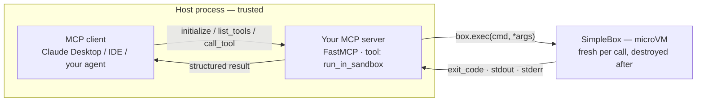

**Outcome:** a stdio MCP server exposing a `run_in_sandbox` tool, verified end to end by a real MCP client.

**Level:** intermediate · **Time:** ~20 minutes · **Pattern:** the box is a tool the model calls.

## When to use this

The Model Context Protocol is becoming the common way to hand external capabilities to LLM clients. When several different agents, IDEs, or desktop clients all need "execute this in an isolated sandbox", you do not want to reimplement the call path for each one. You want one standard tool that every client discovers and calls the same way.

This guide builds that: `SimpleBox.exec` behind an MCP tool named `run_in_sandbox`, so any client gets "run a command in a hardware-isolated microVM and receive stdout, stderr, and the exit code".

The division of labor is worth stating once: **the MCP transport is yours, the sandbox is BoxLite's.** You bring an MCP framework — this guide uses `FastMCP` from the official `mcp` package — and BoxLite provides the isolated execution behind each tool call.

## Architecture



Protocol handling — handshake, tool discovery, JSON-RPC — runs in your process. Every `call_tool` starts a clean `SimpleBox`, runs the command in its own kernel, and destroys the box afterwards.

## Prerequisites

- BoxLite installed and a working virtualization host — see [Installation](/getting-started/installation).
- The official MCP Python SDK, which BoxLite does not bundle.

```bash
pip install boxlite mcp
```

No LLM credentials are needed. This guide exercises the protocol handshake and sandbox execution; credentials only matter when you connect a real client later.

## Build it

### Step 1: the MCP server

Save as `sandbox_mcp_server.py`. It runs directly as a stdio MCP server.

```python
from mcp.server.fastmcp import FastMCP

from boxlite import SimpleBox, BoxliteError

mcp = FastMCP("boxlite-sandbox")


@mcp.tool()
async def run_in_sandbox(command: str, args: list[str] | None = None) -> dict:
    """Run a shell command inside an isolated BoxLite microVM and return its output.

    Args:
        command: The executable to run, for example "echo" or "python3".
        args: Optional argument list.
    """
    args = args or []
    try:
        # image is required; auto_remove destroys the box when the block exits
        async with SimpleBox(image="alpine:latest", auto_remove=True) as box:
            # A non-zero exit code does NOT raise — return it as data
            result = await box.exec(command, *args, timeout=30.0)
            return {
                "exit_code": result.exit_code,
                "stdout": result.stdout,
                "stderr": result.stderr,
            }
    except BoxliteError as exc:
        # Wrapper-layer errors (e.g. ExecError) subclass BoxliteError
        return {"error": f"boxlite error: {exc}"}
    except RuntimeError as exc:
        # Missing virtualization or a failed image pull arrives as RuntimeError
        return {"error": f"runtime failure: {exc}"}


if __name__ == "__main__":
    mcp.run(transport="stdio")
```

### Step 2: a client that proves the handshake works

Save as `mcp_client_test.py`. It launches the server, initializes, discovers tools, and calls one.

```python
import asyncio
import os
import sys

from mcp import ClientSession, StdioServerParameters
from mcp.client.stdio import stdio_client


async def main() -> None:
    server = StdioServerParameters(
        command=sys.executable,             # launch the server with this interpreter
        args=["sandbox_mcp_server.py"],     # path to your server
        env=os.environ.copy(),
    )
    async with stdio_client(server) as (read, write):
        async with ClientSession(read, write) as session:
            init = await session.initialize()
            print("SERVER:", init.serverInfo.name, init.serverInfo.version)

            tools = await session.list_tools()
            print("TOOLS:", [tool.name for tool in tools.tools])

            result = await session.call_tool(
                "run_in_sandbox",
                {"command": "echo", "args": ["hello from the box"]},
            )
            print("RESULT:", result.structuredContent or result.content[0].text)


asyncio.run(main())
```

The `SimpleBox.exec` parameter table is on [MCP tool handler](/agent-tools/mcp-server#parameters-and-returns).

## Run it

```bash
python mcp_client_test.py
```

```text
SERVER: boxlite-sandbox 1.28.0
TOOLS: ['run_in_sandbox']
RESULT: {
  "exit_code": 0,
  "stdout": "hello from the box\n",
  "stderr": ""
}
```

That `stdout` came from `echo` running inside the microVM, serialized back over JSON-RPC.

Now confirm the behavior that surprises people most — a failing command returns data rather than raising. Change the tool call to:

```python
result = await session.call_tool(
    "run_in_sandbox",
    {"command": "sh", "args": ["-c", "echo oops 1>&2; exit 3"]},
)
```

```text
RESULT: {
  "exit_code": 3,
  "stdout": "",
  "stderr": "oops\n"
}
```

The client receives the exit code and stderr as a normal result. Nothing was raised, and nothing crossed into your process.

## Trust and limits

Two layers, with different guarantees.

- **Execution layer — isolated.** Every `call_tool` starts its own microVM with its own kernel, filesystem, memory, and resource budget. However untrusted the command an MCP client sends, `rm -rf /` damages only that box, which is destroyed on exit.
- **Protocol layer — yours to secure.** `FastMCP` runs in your host process, outside any sandbox. Anything that can connect to this server can call `run_in_sandbox`. **Authentication, rate limiting, and any command allowlist are your responsibility** — add them in the tool function before the box is created.
- **Failures arrive as data or as exceptions, never as crashes.** A non-zero exit is returned in the result. Missing virtualization or a failed image pull raises `RuntimeError` (not `BoxliteError`), which the handler above catches and serializes back to the client.
- **Fresh box per call is a deliberate trade.** It gives maximum isolation and costs a start each time. Reusing one long-lived box is faster but lets state leak between calls — see [Next steps](#next-steps).

## Troubleshooting

| Symptom | Cause | Fix |
|---|---|---|
| `ModuleNotFoundError: No module named 'mcp.server.fastmcp'` | The MCP SDK is not installed | `pip install mcp` — BoxLite does not bundle it |
| `ModuleNotFoundError: No module named 'boxlite.mcp'` | The MCP layer lives in your code, not the SDK | Use `FastMCP` and wrap `SimpleBox.exec`, as above |
| Tool returned `exit_code: 1` and nothing looked wrong | `exec` does not raise on a non-zero exit | Return `exit_code` to the client, as this guide does |
| `RuntimeError` rather than `BoxliteError` | Missing virtualization or an image pull failure | Catch `RuntimeError` separately and retry |
| The box start times out | No hardware virtualization | Linux with KVM (user in the `kvm` group) or macOS; see [Installation](/getting-started/installation) |

## Next steps

- **Connect a real client.** Register `sandbox_mcp_server.py` in your client's MCP configuration (`command` plus `args`); it performs the same stdio handshake verified above and discovers `run_in_sandbox` automatically.
- **Add more tools.** Write additional `@mcp.tool()` functions — `read_file` / `write_file` over `copy_in` / `copy_out`, or `run_python` over `CodeBox.run` (see [Build a code interpreter](/use-cases/code-interpreter)).
- **Add access control.** A command allowlist and authentication in the tool function are the first things to add once the server is reachable — see [Run untrusted tools safely](/use-cases/untrusted-tool-execution).
- **Reuse one box per session.** Hold a long-lived box on the server instead of creating one per call, and weigh the speed against the state that then persists across calls.
