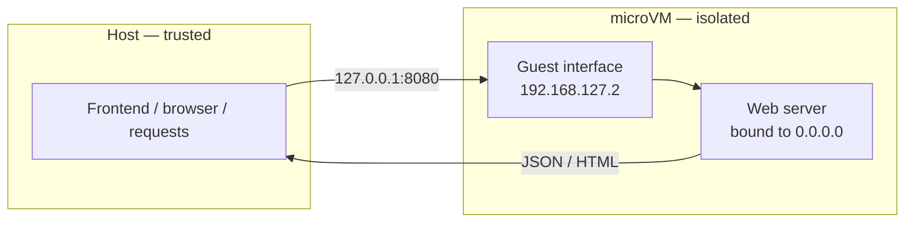

**Outcome:** a long-running service in a sandbox, reachable at `http://127.0.0.1:<PORT>` from your frontend or browser.

**Level:** beginner+ · **Time:** ~15 minutes · **Pattern:** the box is a tool the model calls.

## When to use this

"AI app builder" products all share one shape: a model writes a Flask, FastAPI, or Next.js fragment, and the user sees it **running in a browser seconds later**. That needs more than "execute code, return stdout":

- a **long-lived process** listening on a port inside the isolated environment,
- its **HTTP endpoints** reachable from the host frontend,
- and a guarantee that if that service crashes, gets injected, or tries to read host files, nothing escapes.

Running a user-supplied web server with `subprocess` puts a listening, arbitrary-logic process inside your trust boundary. Port forwarding moves it out: the service listens on `0.0.0.0:<PORT>` in the box, and the host reaches it at `127.0.0.1:<PORT>`.

## Architecture



Two consequences follow from that path:

- **Your exposed surface is exactly the ports you declare.** Anything not listed in `ports=` is invisible to the host.
- **The service must bind `0.0.0.0`.** Forwarded traffic arrives at the guest's *network interface*, not its loopback. A server bound to `127.0.0.1` inside the box is unreachable from the host — the connection is reset.

## Prerequisites

- BoxLite installed and a working virtualization host — see [Installation](/getting-started/installation).
- Any image with Python. This guide uses `python:alpine`, whose standard library is enough — no packages to install.

No LLM credentials are needed: port forwarding is pure BoxLite. Swapping in model-generated code is covered under [Next steps](#next-steps).

## Build it

The app code is a plain string here — in production it is whatever your model generated or your user uploaded. It is written into the box base64-encoded, which avoids shell quoting problems entirely.

```python
import asyncio
import base64
import urllib.error
import urllib.request

from boxlite import SimpleBox

HOST_PORT = 8080
GUEST_PORT = 8080

# The service to run inside the sandbox. A zero-dependency JSON API keeps the
# example self-contained; substitute your generated Flask/FastAPI app here.
APP_CODE = f'''
import json
from http.server import BaseHTTPRequestHandler, HTTPServer

class Handler(BaseHTTPRequestHandler):
    def _json(self, code, payload):
        body = json.dumps(payload).encode()
        self.send_response(code)
        self.send_header("Content-Type", "application/json")
        self.send_header("Content-Length", str(len(body)))
        self.end_headers()
        self.wfile.write(body)

    def do_GET(self):
        if self.path == "/api/health":
            self._json(200, {{"status": "ok"}})
        elif self.path.startswith("/api/preview"):
            self._json(200, {{"html": "<h1>Hello from the sandbox</h1>"}})
        else:
            self._json(404, {{"error": "not found"}})

    def log_message(self, *args):  # silence the default access log
        pass

# Must bind 0.0.0.0 — see Trust and limits
HTTPServer(("0.0.0.0", {GUEST_PORT}), Handler).serve_forever()
'''


async def main() -> None:
    try:
        # 1) Declare the port mapping when the box is created
        async with SimpleBox(
            image="python:alpine",
            name="webapp-preview",
            ports=[(HOST_PORT, GUEST_PORT)],
            reuse_existing=True,   # reuse a box of the same name across previews
        ) as box:
            print(f"box started: {box.id}")

            # 2) Write the app into the box (base64 avoids quoting issues)
            encoded = base64.b64encode(APP_CODE.encode()).decode()
            await box.exec("sh", "-c", "mkdir -p /app")
            await box.exec("sh", "-c", f"echo {encoded} | base64 -d > /app/server.py")

            # 3) Start it in the background so it outlives the exec call.
            #    The server runs beside init, not as it, so the box stays up if the
            #    server dies. Run it as init instead to tie the two together:
            #    /manage-sandbox/lifecycle#three-ways-to-start-work-in-a-box
            await box.exec("sh", "-c", "nohup python /app/server.py > /tmp/app.log 2>&1 &")
            await asyncio.sleep(2)   # give the server a moment to bind

            # 4) Call the forwarded endpoints from the host
            for path in ("/api/health", "/api/preview?id=1", "/api/missing"):
                url = f"http://127.0.0.1:{HOST_PORT}{path}"
                try:
                    with urllib.request.urlopen(url, timeout=5) as response:
                        print(f"GET {path} -> {response.status} {response.read().decode()}")
                except urllib.error.HTTPError as exc:
                    # A 404 from the app is a valid response, not a transport failure
                    print(f"GET {path} -> {exc.code} {exc.read().decode()}")
                except OSError as exc:
                    print(f"GET {path} failed: {exc!r}")
    except RuntimeError as exc:
        print(f"sandbox failed to start: {exc}")


asyncio.run(main())
```

The `ports` parameter table — including the Node shape, which uses objects rather than tuples — lives on [Network access](/manage-sandbox/network-access#port-forwarding-ports).

## Run it

```bash
python webapp_preview.py
```

```text
box started: iZmRhp8KsTaa
GET /api/health -> 200 {"status": "ok"}
GET /api/preview?id=1 -> 200 {"html": "<h1>Hello from the sandbox</h1>"}
GET /api/missing -> 404 {"error": "not found"}
```

All three responses, including the 404, came from the server running inside the microVM. Point a browser or an iframe at the same `http://127.0.0.1:8080/...` to get live preview.

## Trust and limits

- **What the boundary covers.** The service runs on its own kernel and filesystem with its own resource budget. Injection, `rm -rf /`, or an attempt to read host environment variables all stay inside the box; the host only ever receives HTTP on the ports you declared.
- **Your attack surface is the port list.** Keep `ports=` as small as the scenario allows. This is the main security lever in this guide.
- **Binding `0.0.0.0` is a hard requirement.** Traffic is forwarded to the guest's network interface, not its loopback. Bind `127.0.0.1` inside the box and the host gets `Connection reset by peer`. That is topology, not a defect.
- **Nothing health-checks the background process for you.** `exec` returns as soon as the command is launched. Confirm the service is up yourself — a short sleep plus a first request against `/api/health`, as above. Remember too that a non-zero `exec` exit does not raise; check `result.exit_code`.
- **Startup failures are catchable.** No hypervisor or a failed image pull raises `RuntimeError`, not a crash.

## Troubleshooting

| Symptom | Cause | Fix |
|---|---|---|
| `Connection reset by peer` or refused from the host | The service bound `127.0.0.1` inside the box | Bind `0.0.0.0` — e.g. `python -m http.server <PORT> --bind 0.0.0.0` |
| `exec` returned but the service is not running | A foreground process ends with the `exec` call | `nohup ... > /tmp/app.log 2>&1 &`, then `cat /tmp/app.log` to debug |
| The first request times out | The request beat the server to the port | Sleep briefly, or poll `/api/health` until it returns 200 |
| The file written into the box is mangled | Shell quoting ate the newlines | Base64-encode and decode on the way in, as above |
| Host cannot reach the port at all | The tuple order is reversed | The order is `(host_port, guest_port)`; connect to `127.0.0.1:<host_port>` |
| Code changes have no effect | `reuse_existing=True` reused the old box and its old process | Kill the old process, change `name`, or set `reuse_existing=False` |

## Next steps

- **Turn it into an AI app builder.** Replace `APP_CODE` with a model-generated fragment and embed the forwarded URL in an iframe. The LLM call skeleton is in [Build a code interpreter](/use-cases/code-interpreter).
- **Run a real framework.** Use an image with your dependencies (or `pip install flask` in the box) and start it with `flask run --host 0.0.0.0 --port <PORT>`. Declare one `ports` pair per service.
- **Serve many tenants.** For remote, multi-box backends behind one API, use the REST runtime — [Manage remote sandboxes over REST](/guides/agent-service-endpoint).
- **Retrieve build artifacts.** `copy_out("/app/dist", "./dist")` — see [Moving files without a mount](/manage-sandbox/volumes#moving-files-without-a-mount).
