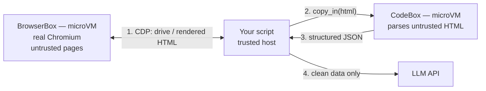

**Outcome:** a `browse -> parse in isolation -> analyze` pipeline built from two boxes.

**Level:** intermediate · **Time:** ~20 minutes · **Pattern:** the agent lives in the box.

## When to use this

An agent that browses the open web faces two problems at once.

**The content is untrusted.** Page scripts can be hostile, downloads can be malicious, and trackers pollute whatever profile they touch. Calling `playwright.launch()` on your host runs arbitrary remote code next to your process. Parsing the HTML afterwards with a heavyweight parser widens the surface further.

**The work does not fit one machine.** Large-scale scraping and cross-browser checks want many browser instances at once, and installing Chromium, Firefox, and WebKit locally is both heavy and messy.

The layered answer: a `BrowserBox` runs the real browser inside a microVM and exposes only a control endpoint; your automation script stays in your trusted process and drives it remotely. The HTML that comes back then goes into a `CodeBox` for parsing, so even the parser runs isolated. Only structured data crosses back.

## Architecture



The automation logic stays on the host; only the browser and the parser are sandboxed. Two separate boxes means a hostile page cannot influence the parsing step either.

## Prerequisites

- BoxLite installed and a working virtualization host — see [Installation](/getting-started/installation).
- A Playwright client pinned to the version inside the box — a mismatch fails the connection with `428 Precondition Required`. You do **not** need `playwright install`; the browsers live in the box.
- An OpenAI-compatible LLM endpoint for the analysis step.
- The first run pulls a multi-gigabyte Playwright image.

```bash
pip install boxlite openai "playwright==1.58.0"
```

## Build it

### Step 1: fetch the page with a real browser

Connect over CDP with `endpoint()`. That path drives the Chromium already baked into the image, so nothing has to be fetched at runtime.

```python
import asyncio
import socket

import boxlite
from playwright.async_api import async_playwright


def free_port() -> int:
    """Pick an unused host port.

    BrowserBox publishes its endpoint on host port 3000 by default. If something
    else on your machine already owns 3000, the ws:// URL would point at that
    unrelated service. Asking for a free port avoids the collision entirely.
    """
    sock = socket.socket()
    sock.bind(("127.0.0.1", 0))
    port = sock.getsockname()[1]
    sock.close()
    return port


async def scrape(url: str) -> str:
    """Open url in the isolated browser and return the rendered HTML."""
    options = boxlite.BrowserBoxOptions(browser="chromium", port=free_port())
    async with boxlite.BrowserBox(options) as browser_box:
        # endpoint() returns ws://localhost:<port>/devtools/browser/<id>
        cdp_ws = await browser_box.endpoint(timeout=120)

        async with async_playwright() as playwright:
            # CDP requires connect_over_cdp(), not connect() and not launch()
            browser = await playwright.chromium.connect_over_cdp(cdp_ws)
            try:
                page = await browser.new_page()
                await page.goto(url, timeout=30000)
                return await page.content()
            finally:
                await browser.close()
```

To use Firefox with Playwright, start the box in Playwright Server mode and connect with `playwright_endpoint()` + `p.firefox.connect(ws)` — the `endpoint()` mode shown above is for Puppeteer, Selenium, and other CDP/BiDi clients. WebKit has no CDP endpoint; it needs the Playwright Server mode described on [Browser automation](/agent-tools/browser-automation#two-connection-modes).

### Step 2: parse the untrusted HTML in a second sandbox

The scraped HTML is never parsed on the host. It is copied into a `CodeBox`, extracted there with the standard library only, and comes back as JSON.

```python
import asyncio
import json

from boxlite import CodeBox
from openai import OpenAI

client = OpenAI()  # reads OPENAI_API_KEY (and OPENAI_BASE_URL if set)

# Runs inside the CodeBox: standard library only, extracts a list of titles
PARSE_CODE = r'''
import re, json, html
src = open("/work/page.html").read()
titles = re.findall(r'<li[^>]*>\s*<a[^>]*>(.*?)</a>', src, re.S)
titles = [html.unescape(re.sub(r"<[^>]+>", "", t).strip()) for t in titles]
print(json.dumps({"count": len(titles), "titles": titles}))
'''


async def parse_and_analyze(html_text: str) -> str:
    # 1) Parse the untrusted HTML inside an isolated CodeBox
    async with CodeBox() as box:
        with open("page.html", "w") as handle:
            handle.write(html_text)
        await box.copy_in("page.html", "/work/page.html")
        parsed = json.loads(await box.run(PARSE_CODE))

    # 2) Only structured data reaches the model
    response = client.chat.completions.create(
        model="<YOUR_MODEL>",  # e.g. "gpt-4o-mini", or any model id your endpoint serves
        messages=[{"role": "user", "content":
            "These are scraped headlines:\n"
            + "\n".join(f"- {title}" for title in parsed["titles"])
            + "\nIn one sentence, what is the common theme? Reply in under 20 words."}],
    )
    return response.choices[0].message.content.strip()


async def main() -> None:
    try:
        html_text = await scrape("https://news.ycombinator.com")
        print(await parse_and_analyze(html_text))
    except RuntimeError as exc:
        print(f"sandbox failed to start: {exc}")


asyncio.run(main())
```

`BrowserBoxOptions` fields and both connection modes are documented on [Browser automation](/agent-tools/browser-automation).

## Run it

```bash
export OPENAI_API_KEY="<YOUR_API_KEY>"
python scrape_and_analyze.py
```

```text
Technology startups, programming, and AI research dominate the current headlines.
```

The page was rendered by a browser in one microVM, parsed in another, and only a list of strings ever reached your process.

## Trust and limits

- **What the boundary covers.** Page scripts, downloads, and any parser weakness are confined to their box. Your process holds only the Playwright client and the extracted data. Both boxes are destroyed on exit.
- **Two boxes is the point.** Parsing hostile HTML is itself risky. Keeping it in a separate `CodeBox` means a page that defeats your extraction logic still has not reached the host.
- **The client version must match the box.** A Playwright client that disagrees with the in-box server fails with `428 Precondition Required`. Pin both.
- **CDP does not cover every browser.** `endpoint()` serves Chromium and Firefox. WebKit requires the Playwright Server mode.
- **Egress is open by default.** Scraping needs that. If the target set should be fixed, add an egress allowlist — see [Run untrusted tools safely](/use-cases/untrusted-tool-execution).

## Troubleshooting

| Symptom | Cause | Fix |
|---|---|---|
| `428 Precondition Required` on connect | Client and in-box Playwright versions differ | Pin the client to the version the image ships |
| The WebSocket connects to something unexpected | Host port 3000 is already taken by another service | Pass an explicit free port in `BrowserBoxOptions(port=...)` |
| `ValueError` from `endpoint()` | The browser is WebKit, which has no CDP endpoint | Use `playwright_endpoint()` with `connect()`, or switch to Chromium |
| `connect()` fails against a Chromium endpoint | CDP needs a different call | Use `connect_over_cdp(ws)` for Chromium; `connect(ws)` is for Firefox BiDi |
| The first run takes several minutes | The Playwright image is multiple gigabytes | Expected once; later starts are fast |
| `page.goto` times out | The site is slow or blocks automation | Raise the timeout; consider `wait_until="domcontentloaded"` |

## Next steps

- **Scrape in parallel.** One box per target URL, run with `asyncio.gather`, and bound the fan-out with a semaphore so you do not start dozens of VMs at once.
- **Cross-browser checks.** The same script against `chromium` and `firefox` boxes, in parallel, with no local browser installs.
- **Turn the data into a chart** — [Build a data analysis agent](/use-cases/data-analysis-agent) picks up where the JSON lands.
- **Interact rather than read.** Filling forms and taking screenshots is on [Browser automation](/agent-tools/browser-automation#advanced-screenshots-and-form-interaction).
